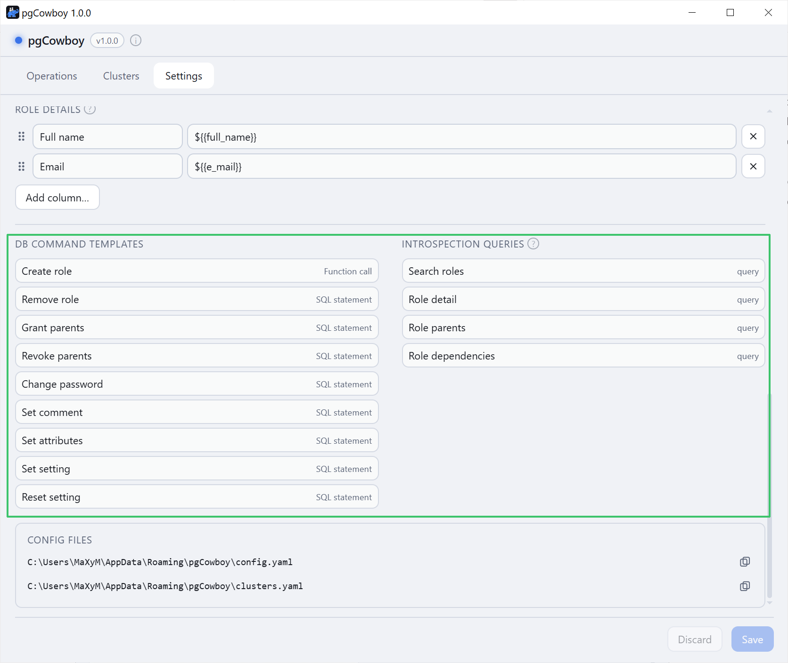
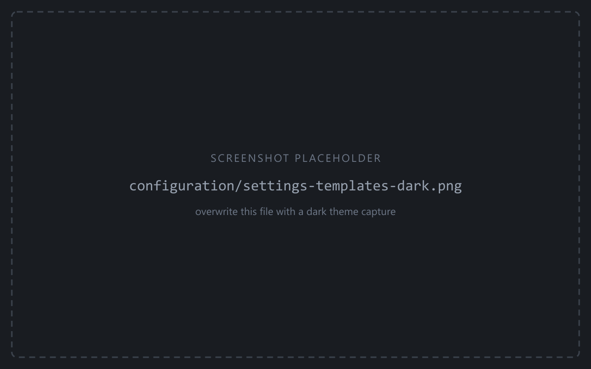
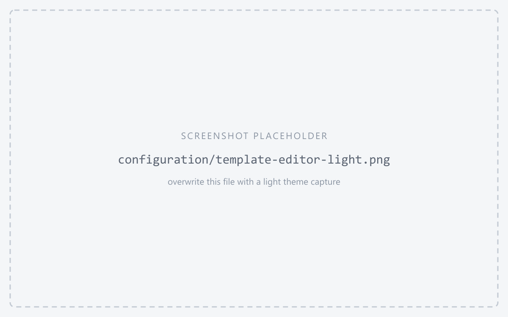
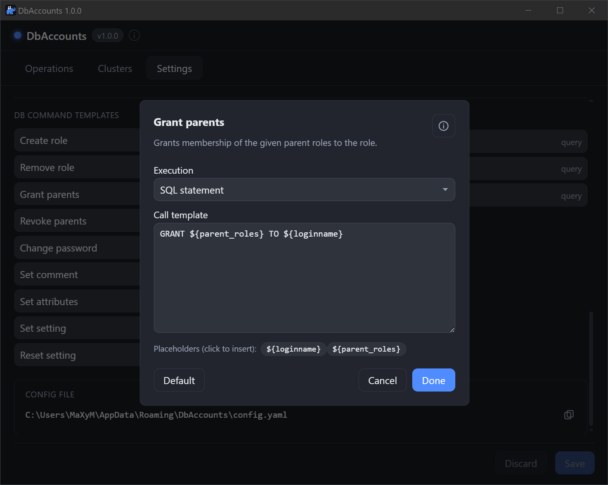

Every change the app makes runs through a **call template** — a short piece of SQL with `${placeholder}` or `${{placeholder}}` fields. Templates live in **Settings → DB command templates**.

Command templates offers three **execution modes*: `statement`, `block` or `function` while introspection templates accepts sql `statements` only.

:::tip
The defaults are plain PostgreSQL and cover everything out of the box. Edit a template when you want the app to go through a wrapper function or view — so a low-privilege connection can create roles via a `SECURITY DEFINER` function, or to add audit logging.
:::

<figure class="shot">
<div class="light-only">



</div>
<div class="dark-only">



</div>
<figcaption>DB command templates and Introspection queries</figcaption>
</figure>

Clicking a command opens its editor: execution mode, the template text, clickable placeholder chips, and a **Default** button that restores the built-in version. The information button in the title bar opens the full syntax reference.

<figure class="shot">
<div class="light-only">



</div>
<div class="dark-only">



</div>
<figcaption>Template editor</figcaption>
</figure>

## Operations and their defaults

| Operation | Default template |
|-----------|------------------|
| `create_role` | `CREATE ROLE ${loginname}` |
| `remove_role` | `DROP ROLE ${loginname}` |
| `grant_parents` | `GRANT ${parent_roles} TO ${loginname}` |
| `revoke_parents` | `REVOKE ${parent_roles} FROM ${loginname}` |
| `change_password` | `ALTER ROLE ${loginname} PASSWORD ${new_password}` |
| `set_comment` | `COMMENT ON ROLE ${loginname} IS ${comment}` |
| `set_attribute` | `ALTER ROLE ${loginname} WITH ${attributes}` |
| `set_config` | `ALTER ROLE ${loginname} SET ${config_name} = ${config_value}` |
| `reset_config` | `ALTER ROLE ${loginname} RESET ${config_name}` |

## Required privileges

Because the defaults are plain DDL, each operation needs whatever its statement needs. A `superuser` covers all of them.

| Operation | Privilege it needs |
|-----------|--------------------|
| `create_role`, `remove_role` | `CREATEROLE` |
| `grant_parents`, `revoke_parents` | `ADMIN OPTION` on each parent role (PostgreSQL 16+) |
| `change_password`, `set_comment` | `CREATEROLE`, plus `ADMIN OPTION` on the role (PostgreSQL 16+) |
| `set_attribute` — Login, Inherit, Create role | `CREATEROLE`, plus `ADMIN OPTION` on the role (PostgreSQL 16+) |
| `set_attribute` — Create DB, Replication, Bypass RLS | the same attribute on the connecting role (PostgreSQL 16+); superuser earlier |
| `set_attribute` — Superuser | superuser, always |
| `set_config`, `reset_config` | `CREATEROLE`, plus `ADMIN OPTION` on the role (PostgreSQL 16+) |
| `set_config` — a superuser-only parameter such as `log_statement` | superuser, or `GRANT SET ON PARAMETER` |

:::tip
To connect as a lower-privileged role, wrap the operations you cannot or will not grant in a `SECURITY DEFINER` function and point the template at it.
:::

## Execution modes

- **statement** / **block** — the template is raw SQL (DDL, `GRANT`, `ALTER ROLE`). PostgreSQL can't bind a role name as `$1`, so the app embeds names as quoted **identifiers** and literals as **escaped strings**. Use `block` when the SQL is a `DO $$ … $$` block.
- **function** — the template is a function call. Values are passed as real bind parameters (`$1`, `$2`, …), which is the safest option when your DDL is wrapped in a function.

## Two placeholder namespaces

- **`${name}`** — a **built-in**, from the closed set the operation offers (the table above). Anything else in single braces is rejected when you save.
- **`${{key}}`** — a **comment field** you configured under [Comment fields](/pgcowboy/configuration/comment-fields/), in `create_role` and `set_comment` only.

:::tip
The two namespaces never overlap, so a comment key named like a built-in still works: `${comment}` is the whole comment, while `${{comment}}` is a JSON key called `comment`.
:::

## How fields are embedded

The app knows the kind of each field, so you don't quote them yourself:

- **Role names** (`loginname`) → double-quoted identifiers, preserving case.
- **`parent_roles`** (create_role, grant_parents, revoke_parents) → in **statement/block** mode a comma-separated list of quoted identifiers (`"a", "b"`); in **function** mode an inline `ARRAY['a', 'b']` literal (values verbatim, an empty selection → `NULL`).
- **`new_password`**, **`comment`**, **`config_value`** → escaped string literals.
- **Comment fields** — one `${{key}}` placeholder per key configured under [Comment fields](/pgcowboy/configuration/comment-fields/) (e.g. `${{full_name}}`, `${{e_mail}}`), available in **`create_role`** and **`set_comment`**. The value comes from the role's JSON comment and is embedded by type: string → quoted literal, number/boolean → bare literal, array/object → JSON text, and an empty/`null`/missing value → bare `NULL`.
- **`config_name`** → a bare, validated GUC name (never quoted).
- **`attributes`** → a space-separated keyword list, each keyword checked against a whitelist (`SUPERUSER`/`NOSUPERUSER`, `CREATEROLE`, `LOGIN`, `REPLICATION`, `BYPASSRLS`, …). All of a cluster's attribute changes are combined into one `ALTER ROLE … WITH …`.

## Examples
### SQL statement

```sql
CREATE ROLE ${loginname}
```
### Function call

Suppose role creation must go through a helper that also assigns fixed groups.

```sql
admin_access.create_role
(
    _role_name     => ${loginname},
    _role_fullname => ${{fullname}},
    _role_email    => ${{email}},
    _role_parents  => ARRAY['gr_personal_users', 'gr_personal_users_ldap']
)

```
:::note
No SELECT/PERFORM in this code, nor semicolon.
:::

### Code block

It provides another way of performing multiple operations.

:::caution[Sub-commits]
Don't use sub-commits. This statements is issued together with others within single transaction. Sub-commits will fail.
:::

```sql
DO LANGUAGE plpgsql $$
BEGIN
  CREATE ROLE ${loginname};
  GRANT gr_personal_users_ldap TO ${loginname};
  ALTER ROLE ${loginname} SET log_statement='all';
END;$$
```

## Read (introspection) queries

Alter-role search and detail, plus the dependency check run before a role is dropped, use four **read** queries, also editable (Settings → Introspection queries, or `db_reads` in config). Each takes a single `${rolename}` bind, and its result columns are matched **by name** against a fixed contract.

:::tip
Because matching is by name, you can point a read query at a privileged wrapper function or view when the connecting user can't read the catalogs directly.
:::

| Query | Contract columns |
|-------|------------------|
| `search_roles` | `rolname`, `comment` |
| `role_detail` | the seven `rol*` flags, `comment`, `rolconfig` |
| `role_parents` | `rolname` |
| `role_dependencies` | `database`, `dependency`, `class`, `object` |

Column order doesn't matter and a missing column is tolerated, but an unexpected extra column is rejected.

### Custom role_dependencies

`role_dependencies` is the pre-flight check: it runs on every cluster a removal targets, and its rows are shown per cluster before anything is dropped.

The query is executed against connected database, identifing dependencies on all databases of the cluster. Unfortunatelly it can resolv fully qualified identifiers of these objects only for connected database. If you have `dblink` installed, you can write a function that looks up to each database in the cluster collecting needed data. Here is an example

<details>
<summary>Code of role_depenendencies() function</summary>

:::note
The proposed implementation uses pg service files. It's possible you will need to adjust that to own needs.
:::

```sql
CREATE OR REPLACE FUNCTION admin.role_depenendencies(_rolename TEXT)
RETURNS TABLE (database TEXT, dependency TEXT, class TEXT, object TEXT)
LANGUAGE plpgsql
AS $x$
DECLARE
    _dbs RECORD;
    _nconn   oid[];  -- collect unreachable dbs
    _conn    TEXT;   -- dblink conn name
    _connstr TEXT;   -- connection string
    _sql     TEXT = format($sql$
                SELECT COALESCE(d.datname, current_database()) AS database,
                       CASE s.deptype
                           WHEN 'o' THEN 'owner'
                           WHEN 'a' THEN 'privileges (ACL)'
                           WHEN 'i' THEN 'initial privileges'
                           WHEN 'r' THEN 'RLS policy'
                           WHEN 't' THEN 'tablespace'
                           WHEN 'p' THEN 'pinned (system)'
                       END AS dependency,
                       s.classid::regclass::TEXT AS class,
                       CASE WHEN s.dbid = 0 OR d.datname = current_database()
                            THEN pg_describe_object(s.classid, s.objid, s.objsubid)
                            ELSE 'oid: ' || s.objid || CASE WHEN s.objsubid = 0 THEN '' ELSE '; sub oid: ' || s.objsubid END
                       END AS object
                FROM pg_shdepend      AS s
                JOIN pg_roles         AS r ON r.oid  = s.refobjid
                LEFT JOIN pg_database AS d ON s.dbid = d.oid
                WHERE s.refclassid = 'pg_authid'::regclass
                  AND r.rolname    = %L
                $sql$, _rolename);
BEGIN

    CREATE TEMPORARY TABLE res (database TEXT, dependency TEXT, class TEXT, object TEXT) ON COMMIT DROP;

    -- try to fetch remote dependencies
    FOR _dbs IN

        SELECT oid, datname
        FROM pg_database
        WHERE datname <> current_database()

    LOOP

        _conn = NULL;

        BEGIN
            -- use you own implementation of dblink connection
            _conn = 'conn_' || _dbs.datname;

            IF NOT _conn = ANY(COALESCE(dblink_get_connections(), Array[]::TEXT[]))
            THEN

                _connstr = format('service=%s', 's_' || _dbs.datname);
                PERFORM dblink_connect(_conn, _connstr);

            END IF;

        EXCEPTION WHEN OTHERS THEN
            _nconn = _nconn || _dbs.oid;
            _conn = NULL;

        END;

        IF _conn IS NOT NULL
        THEN

            PERFORM dblink_exec(_conn, 'SET search_path = ''''', TRUE); -- to ensure fully qualified identifiers resolved properly

            INSERT INTO res (database, dependency, class, object)
            SELECT x.database, x.dependency, x.class, x.object
            FROM dblink(_conn, _sql || ' AND (s.dbid = 0 OR d.datname = current_database())', TRUE)
                    AS x(database TEXT, dependency TEXT, class TEXT, object TEXT);

            PERFORM dblink_disconnect(_conn);

        END IF;

    END LOOP;

    -- local + unresolved remote dependencies
    SET search_path = ''; -- to ensure fully qualified identifiers resolved properly
    EXECUTE  'INSERT INTO res (database, dependency, class, object) ' || _sql || ' AND ((s.dbid = 0 OR d.datname = current_database()) OR s.dbid = ANY (' || quote_literal(_nconn) || '))';
    RESET search_path;

    RETURN QUERY
    SELECT *
    FROM res;

END;
$x$;

COMMENT ON FUNCTION admin.role_depenendencies(_rolename TEXT) IS $$
Returns information about objects that depend on the login role whose name is passed as the argument.

Useful for identifying dependencies that would prevent the role from being dropped.

The function uses dblink to connect to other databases in the cluster, which is required to resolve object identifiers. If a connection cannot be established, the object's OID is returned instead.
$$;

```

</details>

Once deployed, replace `role_dependencies` template with

```sql
SELECT database, dependency, class, object
FROM admin.role_depenendencies(${rolename})
ORDER BY 1, 2, 3, 4
```

:::tip
Full syntax, the field whitelist, examples and common mistakes are in the repository's [`sql/README.md`](https://github.com/michal-bartak/pgcowboy/blob/main/sql/README.md).
:::
