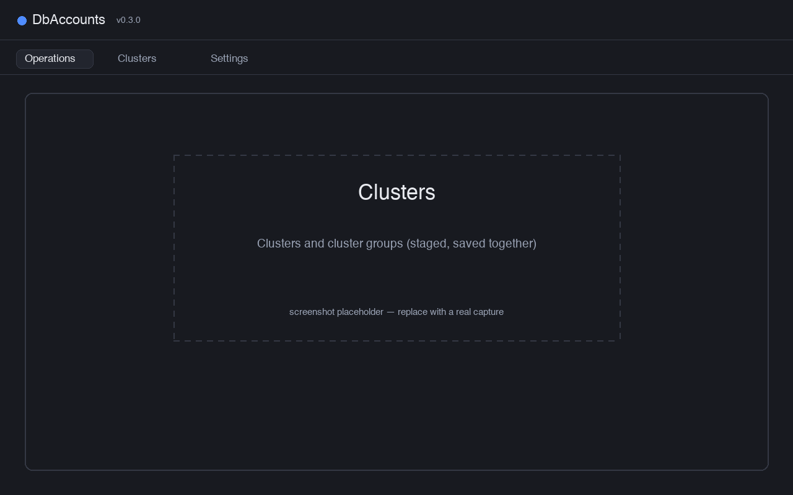

The **Clusters** tab holds every database the app can reach, and the groups they belong to.
Editing is staged — press **Save** to write, **Discard** to revert.

Each row's **Actions** cell has **✎ edit** and **× delete**. The **Status** column is filled
by **Test connections**.

## Cluster fields

<figure class="shot-todo" data-shot="cluster-editor.png">
  <figcaption>Cluster editor — every field, with the password reveal toggle</figcaption>
</figure>

| Field | Notes |
|-------|-------|
| **Alias** | Display name. Required, and how the cluster appears everywhere else. |
| **Host** / **Port** | Port defaults to `5432`. |
| **Database** | The database to connect to. Required. |
| **SSL mode** | `prefer` (default), `disable`, `require`, `verify-ca`, `verify-full`. |
| **Username** | Optional. See credentials below. |
| **Password** | Optional, masked, with a 👁 reveal toggle. |
| **Category** | Required. The cluster group this cluster belongs to — it sets the colour and the confirmation gate. |

## Credentials

The app resolves credentials the way `psql` does. First match wins:

- **User** — the cluster's **Username** → `PGUSER` → your OS login name.
- **Password** — the cluster's **Password** → `PGPASSWORD` → `~/.pgpass` → none (works with
  trust authentication).

:::caution[The password is stored in clear text]
The optional per-cluster password is written to the configuration file. The file is created
with owner-only permissions, but it is not encrypted. Leave it blank and use `~/.pgpass` if
that matters to you.
:::

## Testing connections

- **Test connections** (toolbar) checks every **saved** cluster and writes the result into
  each row's Status column.
- **Test connection** (inside the cluster editor) tests the values currently on screen, so
  you can verify a host or password before saving.

## Cluster groups

Groups are edited from the **Cluster groups** button in the toolbar.

<figure class="shot-todo" data-shot="cluster-groups.png">
  <figcaption>Cluster groups dialog and the group editor — label, colour, require confirmation</figcaption>
</figure>

| Field | Notes |
|-------|-------|
| **Label** | Shown on scope labels and cluster rows. Its slug becomes the group id, fixed after creation. |
| **Colour** | Base colour used for that group everywhere in the app. |
| **Require confirmation** | Any run touching this group stops at a confirmation dialog first. |

The confirmation gate is the flag — not the group's name. You decide which groups count as
production. A group cannot be deleted while a cluster still uses it.
