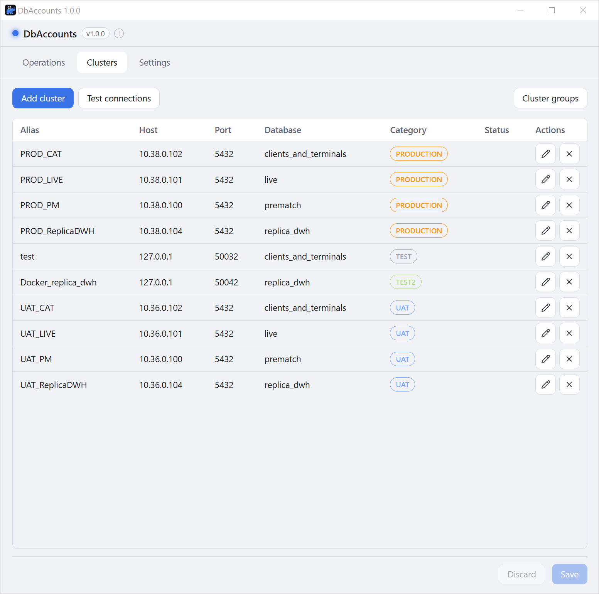
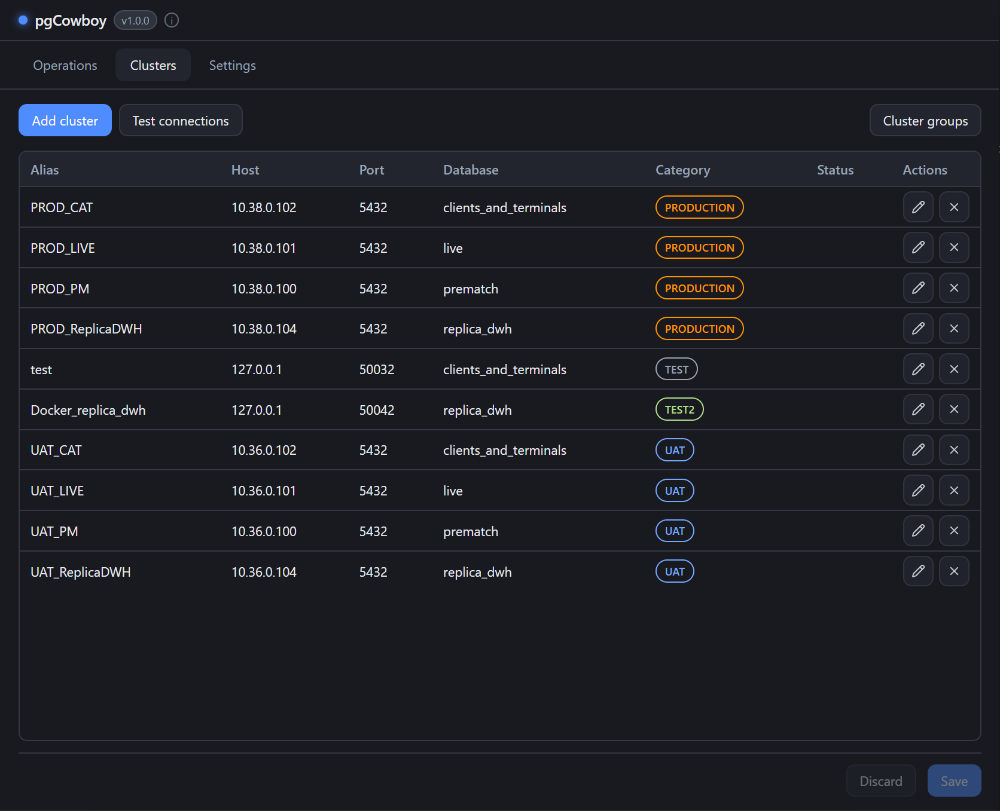
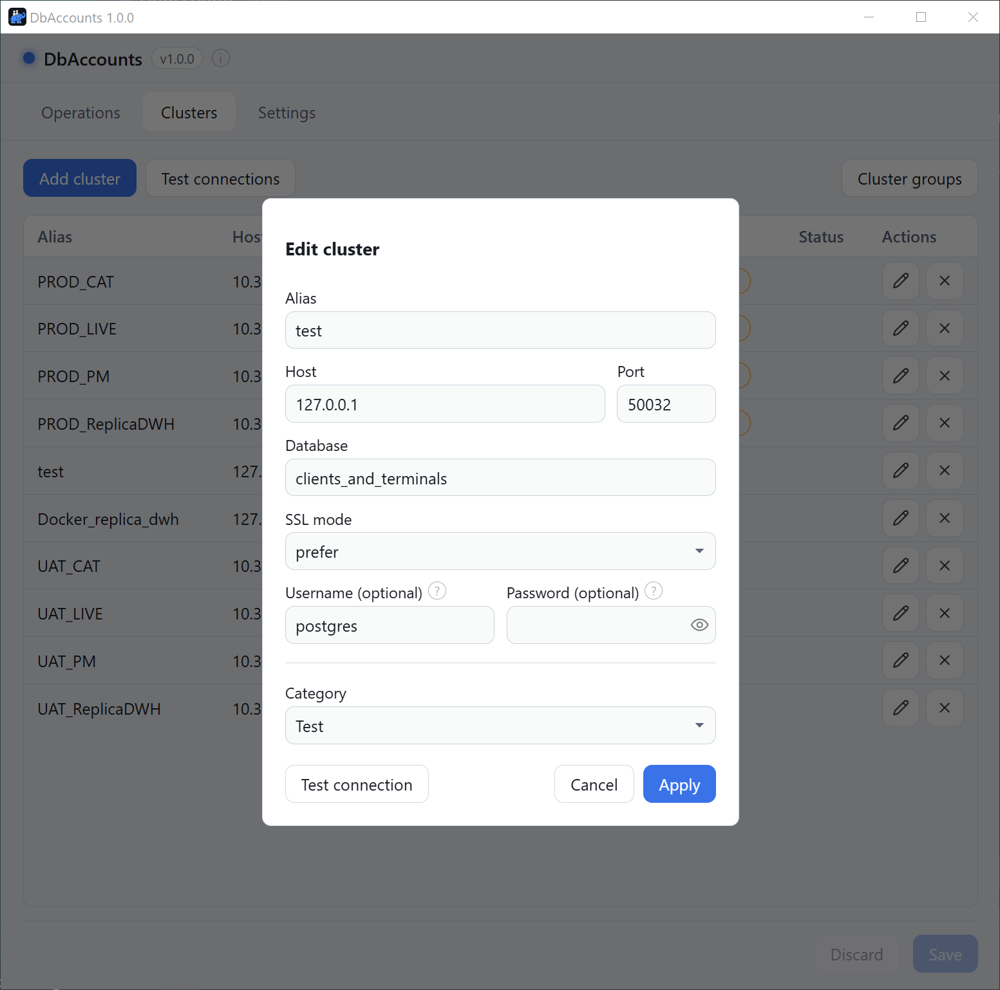
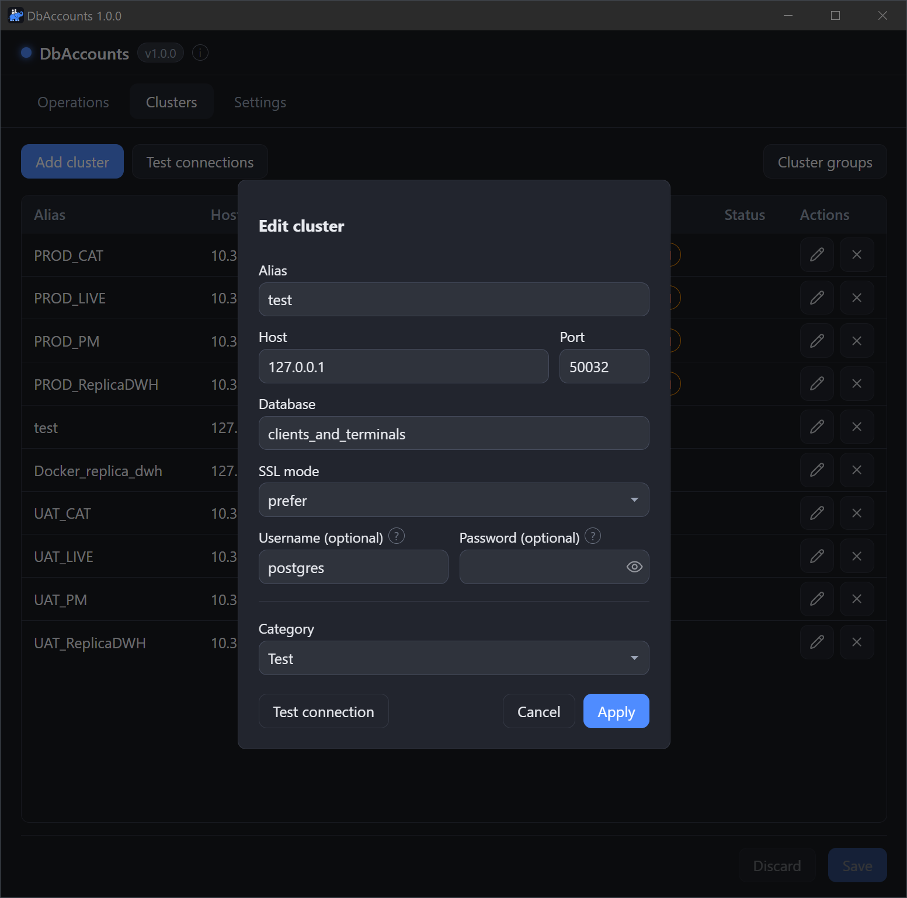
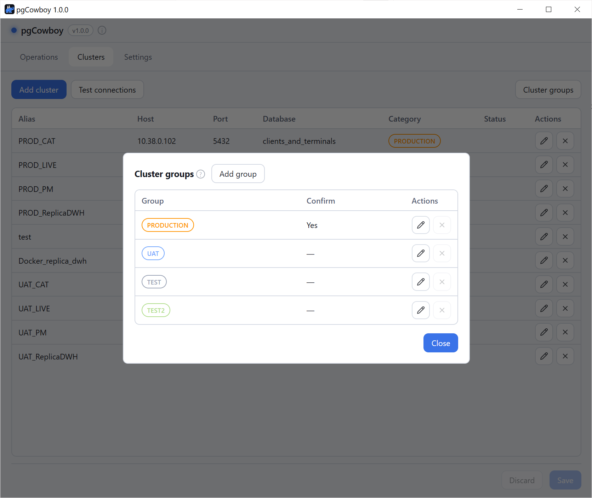
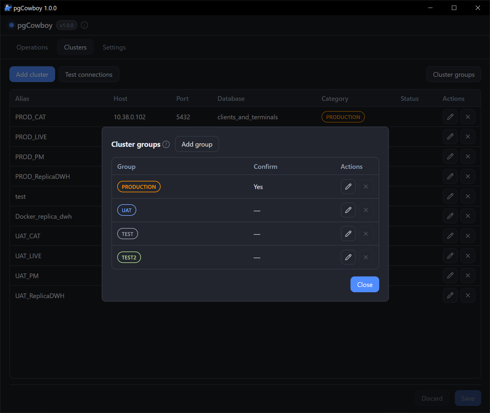
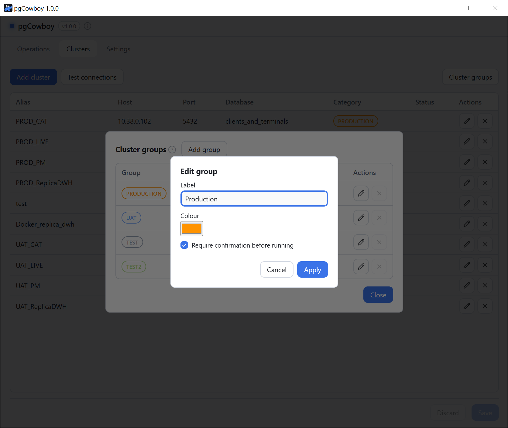
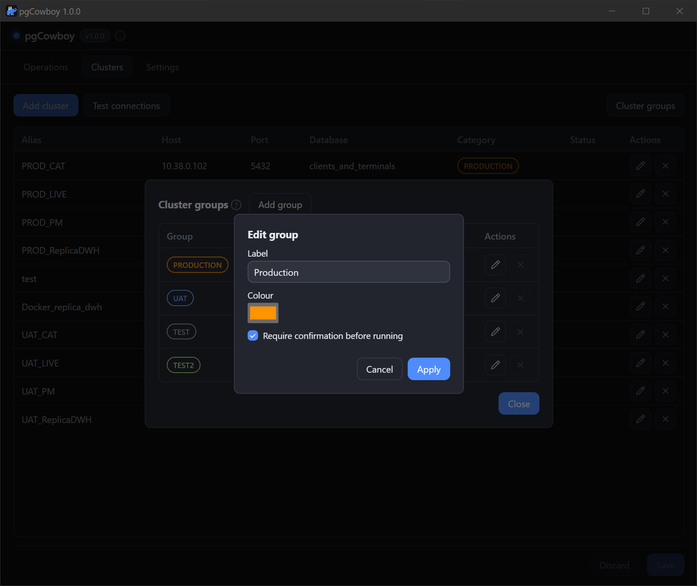

The **Clusters** tab holds every database the app can reach, and the groups they belong to. Groups helps adresing multiple clusters (ie all production ones) with single click. Groups also provides a color, used to color-code information on role edit page.

Editing of clusters and cluster groups is staged — press **Save** to confirm, **Discard** to revert.

<figure class="shot">

<figcaption>Clusters tab</figcaption>
</figure>

Each cluster's row has
<svg class="doc-ic" width="1.05em" height="1.05em" viewBox="0 0 24 24" fill="none" stroke="currentColor" stroke-width="2" stroke-linecap="round" stroke-linejoin="round" aria-hidden="true"><path d="M21.174 6.812a1 1 0 0 0-3.986-3.987L3.842 16.174a2 2 0 0 0-.5.83l-1.321 4.352a.5.5 0 0 0 .623.622l4.353-1.32a2 2 0 0 0 .83-.497z"/><path d="m15 5 4 4"/></svg> **edit** and
<svg class="doc-ic" width="1.05em" height="1.05em" viewBox="0 0 24 24" fill="none" stroke="currentColor" stroke-width="2" stroke-linecap="round" stroke-linejoin="round" aria-hidden="true"><line x1="18" y1="6" x2="6" y2="18"/><line x1="6" y1="6" x2="18" y2="18"/></svg> **delete** buttons. The **Status** column is
filled by result of **Test connections** action.

## Cluster configuration

<figure class="shot">

<figcaption>Cluster connection editor</figcaption>
</figure>

| Field | Notes |
|-------|-------|
| **Alias** | Display name. Required |
| **Host** | Host address |
| **Port** | Connection port. Defaults to `5432`. |
| **Database** | The database to connect to. Required. |
| **SSL mode** | `prefer` (default), `disable`, `require`, `verify-ca`, `verify-full`. |
| **Username** | Optional. See [Credentials](#credentials) below. |
| **Password** | Optional, masked, with a <svg class="doc-ic" width="1.05em" height="1.05em" viewBox="0 0 24 24" fill="none" stroke="currentColor" stroke-width="1.8" stroke-linecap="round" stroke-linejoin="round" aria-hidden="true"><path d="M1.5 12S5 5 12 5s10.5 7 10.5 7-3.5 7-10.5 7S1.5 12 1.5 12Z"/><circle cx="12" cy="12" r="3.2"/></svg> reveal toggle. |
| **Group** | Required. The cluster group this cluster belongs to — it sets the colour and the confirmation gate. |

## Credentials

The app resolves credentials the way `psql` does. First match wins:

- **User** — the cluster's **Username** → `PGUSER` → your OS login name.
- **Password** — the cluster's **Password** → `PGPASSWORD` → `~/.pgpass` → none (works with trust authentication).

:::caution[The password is stored in clear text]
The per-cluster password is written to `clusters.yaml`. The file is created with owner-only permissions, but it is not encrypted. Leave it blank and use `~/.pgpass` if that matters to you.
:::

## Testing connections

- **Test connections** (toolbar) checks every **saved** cluster and writes the result into each row's Status column.
- **Test connection** (inside the cluster editor) tests the values currently on screen, so you can verify a host or password before saving.

## Cluster groups

Groups are edited from the **Cluster groups** button in the toolbar. The dialog lists every group with its colour, whether it requires confirmation, and per-row
<svg class="doc-ic" width="1.05em" height="1.05em" viewBox="0 0 24 24" fill="none" stroke="currentColor" stroke-width="2" stroke-linecap="round" stroke-linejoin="round" aria-hidden="true"><path d="M21.174 6.812a1 1 0 0 0-3.986-3.987L3.842 16.174a2 2 0 0 0-.5.83l-1.321 4.352a.5.5 0 0 0 .623.622l4.353-1.32a2 2 0 0 0 .83-.497z"/><path d="m15 5 4 4"/></svg> **edit** and
<svg class="doc-ic" width="1.05em" height="1.05em" viewBox="0 0 24 24" fill="none" stroke="currentColor" stroke-width="2" stroke-linecap="round" stroke-linejoin="round" aria-hidden="true"><line x1="18" y1="6" x2="6" y2="18"/><line x1="6" y1="6" x2="18" y2="18"/></svg> **delete** actions.

<figure class="shot">

<figcaption>Cluster groups dialog</figcaption>
</figure>

**Add group** and the row's edit button open the same small form. **Apply** stages the change; like everything else on the Clusters tab it is only written when you press **Save** in the footer.

<figure class="shot">

<figcaption>Group editor</figcaption>
</figure>

| Field | Notes |
|-------|-------|
| **Label** | Shown on scope labels and cluster rows. Its slug becomes the group id, fixed after creation. |
| **Colour** | Base colour used for that group everywhere in the app. |
| **Require confirmation** | Any run touching this group stops at a confirmation dialog first. |

:::tip
The confirmation gate is the flag deciding which groups count as critical ones. Such a group deserve additional confirmation popup when providing changes to roles.
:::

:::caution
A group cannot be deleted while a cluster still uses it.
:::
