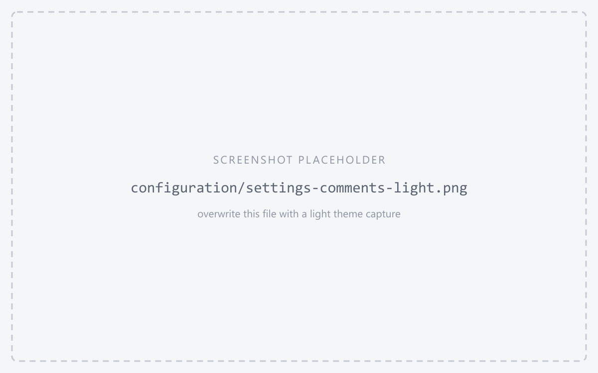
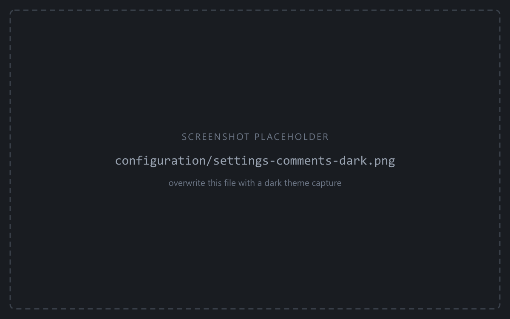

A role comment can be plain text or JSON. **Comment fields** decide which JSON keys the role
form shows as labelled inputs, and in what order.

<figure class="shot">

<figcaption>Settings → Comments — the field list with drag handles, Add field, and Preferred comment view</figcaption>
</figure>

## The field list

Each entry is a **key** (the JSON key, a bare identifier) and a **label** (what the form
shows). Drag the handle to reorder;
<svg class="doc-ic" viewBox="0 0 24 24" fill="none" stroke="currentColor" stroke-width="2" stroke-linecap="round" stroke-linejoin="round" aria-hidden="true"><line x1="18" y1="6" x2="6" y2="18"/><line x1="6" y1="6" x2="18" y2="18"/></svg> removes an entry; **Add field…** appends one.
Defaults are `full_name` → *Full name* and `e_mail` → *Email*.

Rules:

- Configured fields always render, even when the key is absent from the comment.
- Keys **not** on the list still render, labelled by their raw key — nothing is hidden.
- Values that aren't strings (number, boolean, array, object) render **read-only**, so their
  type survives a round trip. Edit them in the Raw view.
- Leaving the label blank falls back to the key.

Each configured key also becomes a placeholder — `${full_name}`, `${e_mail}`, … — usable in
the `create_role` and `set_comment`
[call templates](/pg-accounts-management/configuration/call-templates/).

## Preferred comment view

Sets which mode a **new or empty** comment opens in — **Fields** or **Raw**. Comments that
already have content detect their own mode: JSON opens in Fields, anything else in Raw.

See [Altering the comment](/pg-accounts-management/usage/comments/) for the editor itself.
