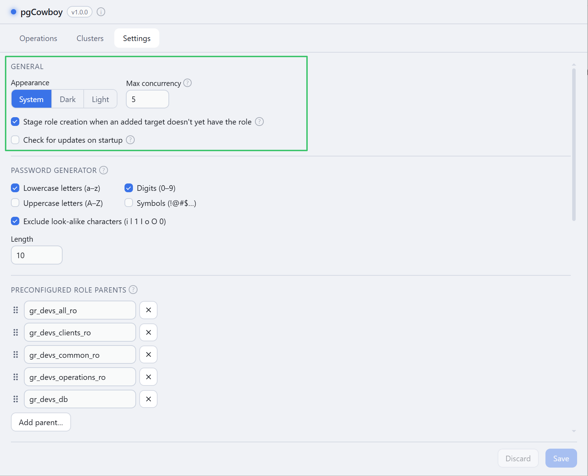
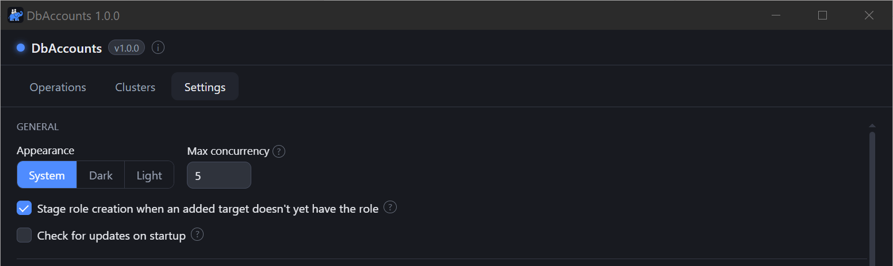

<figure class="shot">

<figcaption>Settings → General — Appearance, Max concurrency, and both checkboxes</figcaption>
</figure>

## Appearance

**System**, **Dark**, or **Light**. System follows your desktop theme.

## Max concurrency

How many clusters a run touches at once (1–50, default 5). Each cluster still gets its own
connection and its own transaction; this only caps how many run in parallel. Lower it if your
servers or network object to a burst of connections.

## Stage role creation for added targets

In **Alter role**, when you add a target where the role doesn't exist yet:

- **On** — the role creation is staged for that cluster automatically.
- **Off** — the cluster is only brought into view. You can still add the role yourself from
  the [Present on](/pgcowboy/usage/presence/) section.

## Check for updates on startup

Checks the project's GitHub Releases on launch and shows a popup when a newer version exists.
A dot on the **ⓘ** button in the header marks a pending update, and it survives a restart. A
manual check is always available in the About dialog, whether or not this option is on.
