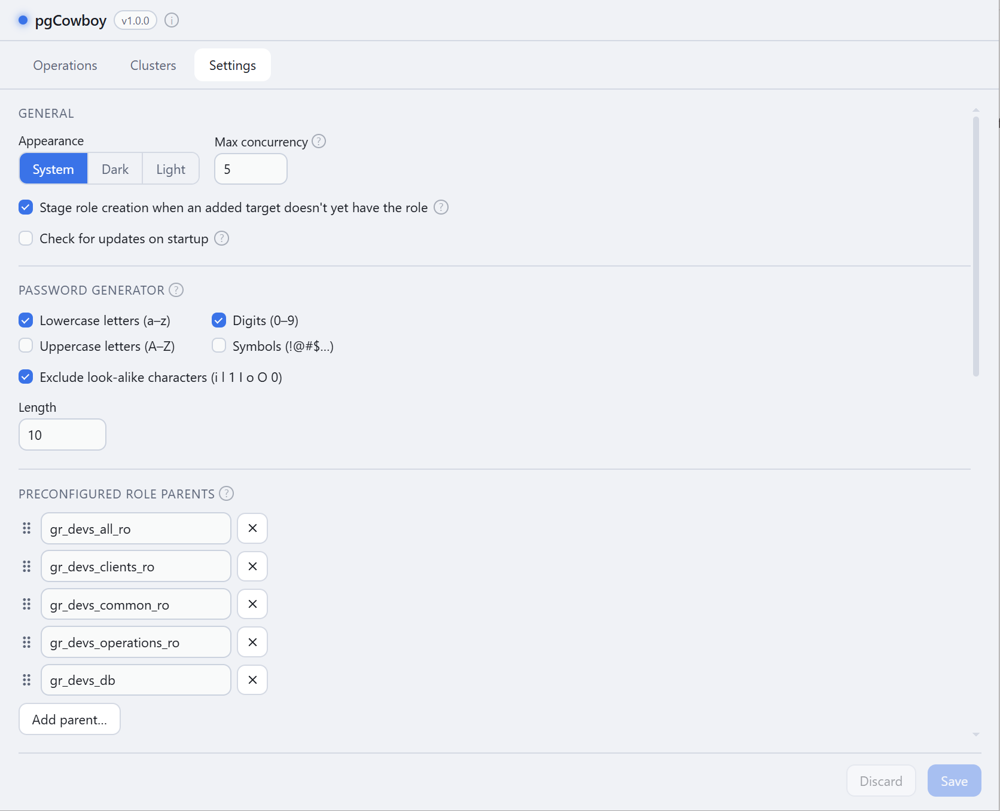
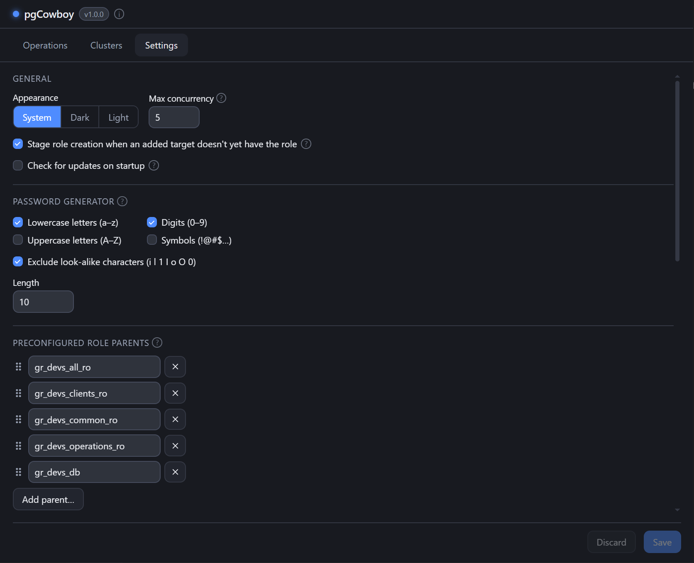

Configuration lives on two tabs:

- **Clusters** — the clusters you connect to and the groups they belong to.
- **Settings** — everything else: comment fields, call templates, role parents, the
  password generator, and general preferences.

Both tabs are **staged**. Adds, edits, and deletes change an on-screen draft; nothing is
written until you press **Save**. **Discard** reverts to the saved state. Save is active only
while there are unsaved changes.

<figure class="shot">

<figcaption>Settings tab — all sections, with the Discard / Save footer</figcaption>
</figure>

## Sections

| Section | What it controls |
|---------|------------------|
| [Clusters](/pg-accounts-management/configuration/clusters/) | Connection details, credentials, groups |
| [Comment fields](/pg-accounts-management/configuration/comment-fields/) | JSON keys shown as labelled inputs |
| [Call templates](/pg-accounts-management/configuration/call-templates/) | The SQL behind every read and write |
| [Preconfigured role parents](/pg-accounts-management/configuration/parent-roles/) | Role names offered as quick picks |
| [Password generator](/pg-accounts-management/configuration/password-generator/) | Length and character classes |
| [General](/pg-accounts-management/configuration/general/) | Appearance, concurrency, update check |

## Configuration files

Two YAML files sit side by side, both written with owner-only permissions:

| OS | Directory |
|----|-----------|
| macOS | `~/Library/Application Support/DbAccounts/` |
| Linux | `~/.config/dbaccounts/` |
| Windows | `%AppData%\DbAccounts\` |

- **`config.yaml`** — call templates, introspection queries, role parents, comment fields, search
  columns and UI preferences. Not site-specific, so it is the one you can share with colleagues.
- **`clusters.yaml`** — your clusters, their groups, and the remembered target selection. This is
  the file that may hold per-cluster passwords in clear text.

You can edit either by hand while the app is closed. See
[`config.example.yaml`](https://github.com/michal-bartak/pg-accounts-management/blob/main/config.example.yaml)
and
[`clusters.example.yaml`](https://github.com/michal-bartak/pg-accounts-management/blob/main/clusters.example.yaml)
for commented references.
