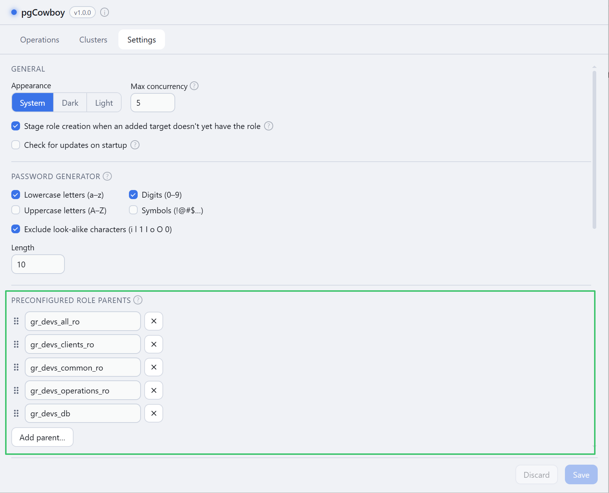
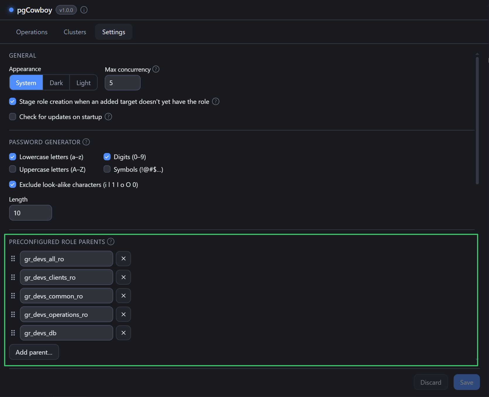
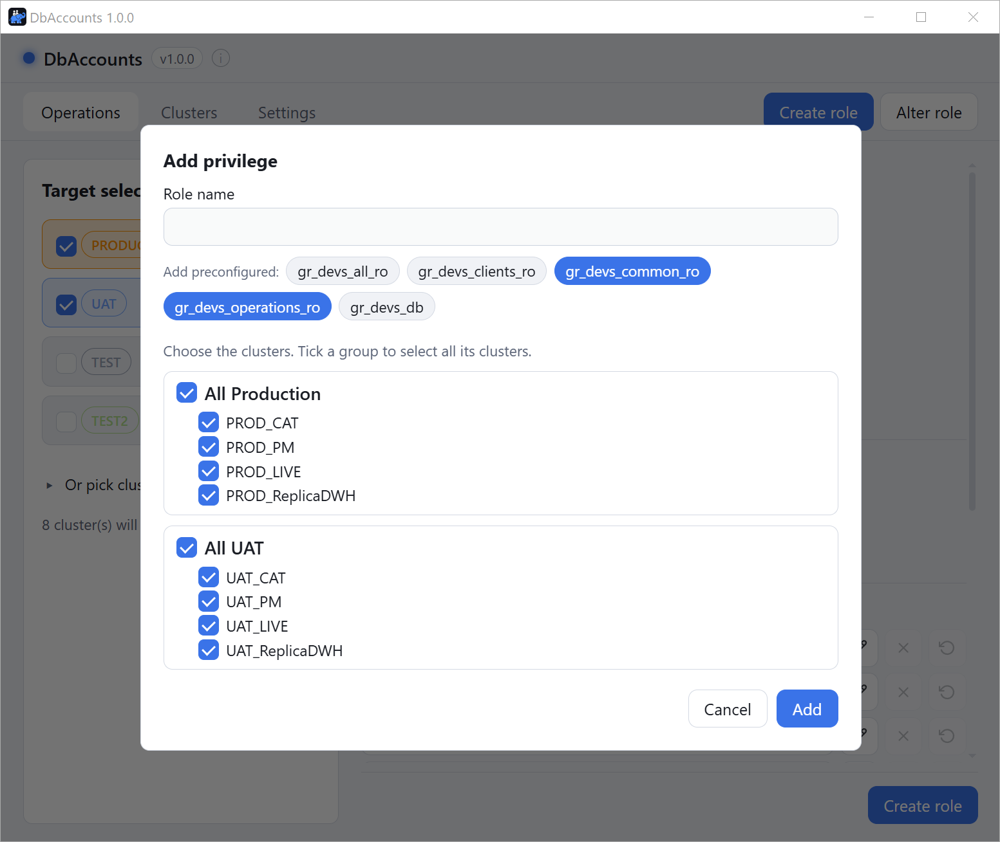
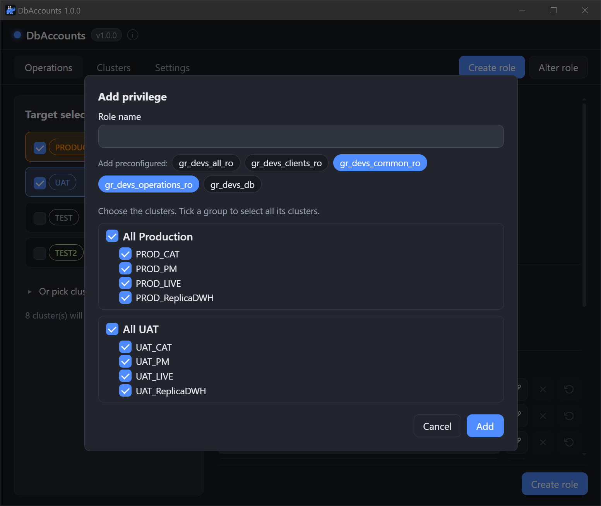

A short list of role names you grant often. They appear as **toggle chips** in the Create-role
form and in the Assign-parents dialog, so you can pick several at once instead of typing them.
Any role can be a parent — the name is about what the role *does here*, not what kind of role it is.

<figure class="shot">

<figcaption>Settings → Preconfigured role parents — list with drag handles and Add parent</figcaption>
</figure>

- Each entry is a bare role identifier. Invalid names are rejected on save, duplicates are
  dropped. <svg class="doc-ic" viewBox="0 0 24 24" fill="none" stroke="currentColor" stroke-width="2" stroke-linecap="round" stroke-linejoin="round" aria-hidden="true"><line x1="18" y1="6" x2="6" y2="18"/><line x1="6" y1="6" x2="18" y2="18"/></svg> removes one.
- Drag the handle to reorder — the order is the chip order.
- The list is a convenience, not a restriction: you can still assign any role by typing its name —
  several at once, separated by commas — and you can mix typed names with picked chips.

<figure class="shot">

<figcaption>Assign parents dialog — preconfigured role parents shown as selectable chips</figcaption>
</figure>

Selected parents feed the `${parent_roles}` placeholder in both the `create_role` and
`grant_parents` [call templates](/pg-accounts-management/configuration/call-templates/).
