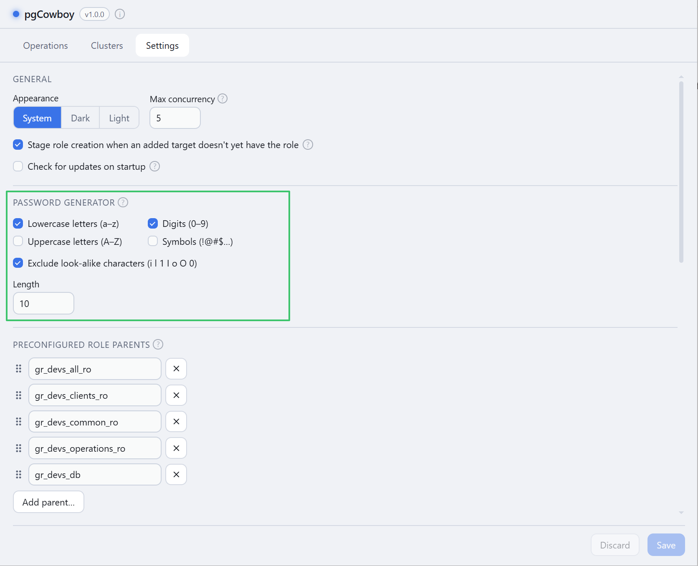
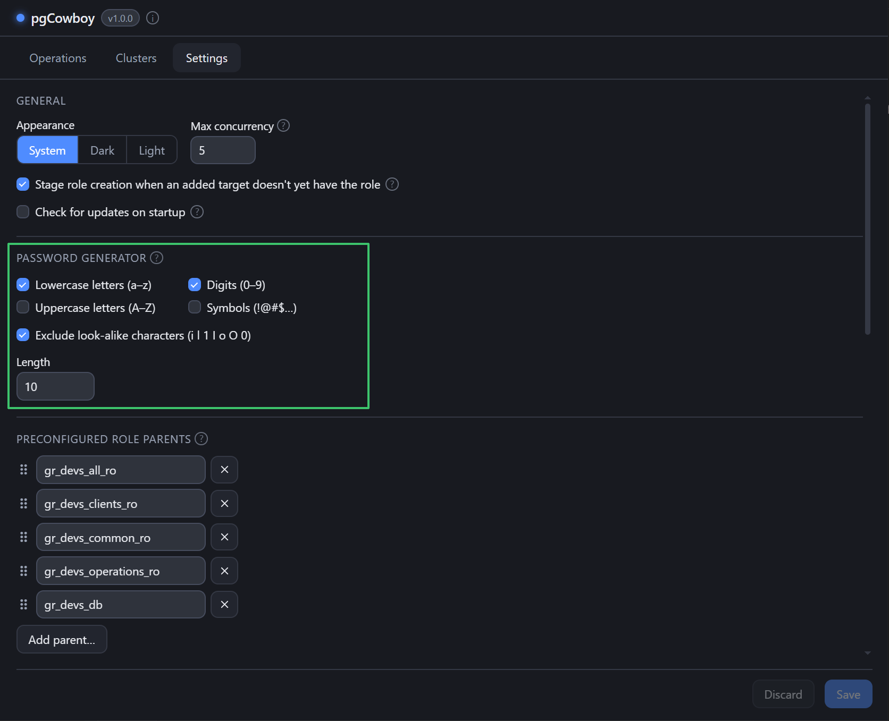

Controls the random password produced by **Generate** on the role form's password field.

<figure class="shot">

<figcaption>Password generator settings</figcaption>
</figure>

| Option | Notes |
|--------|-------|
| **Lowercase letters (a–z)** | On by default. |
| **Uppercase letters (A–Z)** | |
| **Digits (0–9)** | |
| **Symbols (!@#$…)** | |
| **Exclude look-alike characters** | Drops `i l 1 I o O 0`, for passwords that get read aloud or retyped. |
| **Length** | Between 6 and 128. |

Passwords are generated with the platform's cryptographic random source. See [Setting a password](/pgcowboy/usage/password/) for the field itself.

:::caution
At least one class stays enabled — turn them all off and lowercase comes back on.
:::
