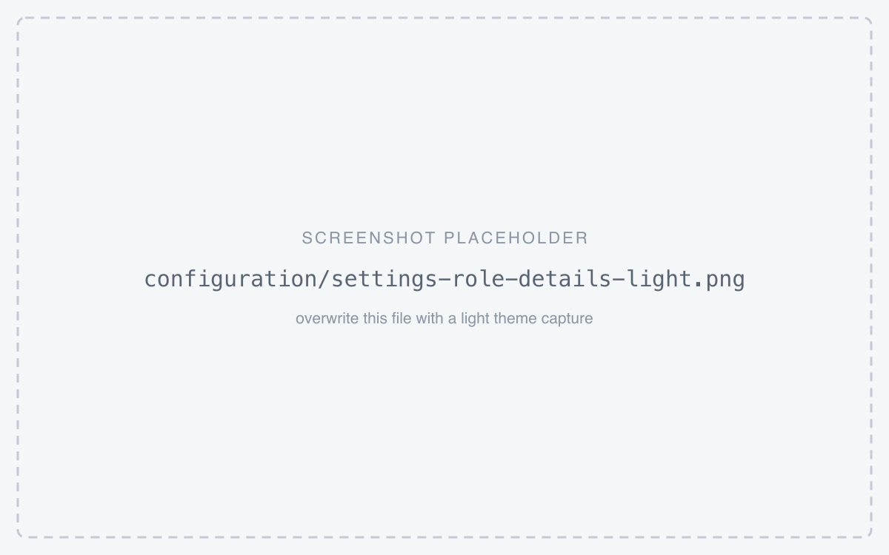
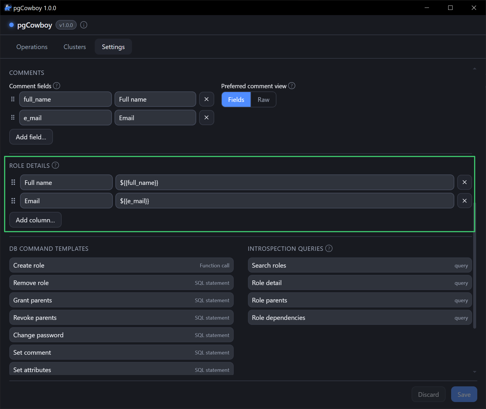

Searching for a role lists every match by name. **Role Details** decides what is shown *beside*
each name — a full name, an email, whatever your comments happen to carry — so you can tell two
similar accounts apart without opening either.

Nothing here is hardcoded. The role name is always the first column; every column after it is one
you configure.

<figure class="shot">
<div class="light-only">



</div>
<div class="dark-only">



</div>
<figcaption>Settings → Role Details — one row per column, each a label and a template</figcaption>
</figure>

## The column list

Each row is a **label** (the column header) and a **template** (what to show). Drag the handle to
reorder;
<svg class="doc-ic" viewBox="0 0 24 24" fill="none" stroke="currentColor" stroke-width="2" stroke-linecap="round" stroke-linejoin="round" aria-hidden="true"><line x1="18" y1="6" x2="6" y2="18"/><line x1="6" y1="6" x2="18" y2="18"/></svg> removes a row; **Add column…** appends one.

Out of the box there is a single *Full name* column over `${{full_name}}`.

## Templates

A template is display text — never SQL — and it supports exactly two placeholders:

| Placeholder | Resolves to |
|---|---|
| `$` | that key's value in the role's JSON comment |
| `${comment}` | the whole comment, verbatim |

`$` reaches **any** key in the comment, whether or not it is listed under
[Comment fields](/pg-accounts-management/configuration/comment-fields/) — that list only decides
which keys get labelled inputs in the role form.

`${comment}` is the one to use for **plain-text** comments, which have no keys to address.

Anything else is refused when you save, including the
[call-template](/pg-accounts-management/configuration/call-templates/) names `${loginname}` and
`${parent_roles}`. Those belong to templates that build SQL; a display column has no use for them.

### Combining keys

Because a template is just text, several keys can feed one column — and one comment can feed
several columns:

| Label | Template | Shows |
|---|---|---|
| Full name | `${{first_name}} ${{last_name}}` | `Ada Lovelace` |
| Email | `${{e_mail}}` | `ada@example.com` |
| Raw comment | `${comment}` | `{"first_name":"Ada", …}` |

Literal text between placeholders is kept as typed, so `${{last_name}}, ${{first_name}}` shows
`Lovelace, Ada`.

### Keys named like a placeholder

The two forms are independent, so a comment that carries its own `comment` key is still reachable:

```json
{ "full_name": "Ada Lovelace", "comment": "on call until March" }
```

- `${comment}` → the whole JSON above
- `${{comment}}` → `on call until March`

## What happens to missing or odd values

- An unknown key, a JSON `null`, and a plain-text comment all resolve to **empty**.
- Surrounding whitespace is collapsed, so `${{first_name}} ${{last_name}}` shows `Ada` — not
  `Ada ` — for a role with no last name.
- Values that aren't strings render typed: `42`, `true`, `["a","b"]`.
- When a role's comment **differs between clusters**, each column shows the first value it finds,
  looking through the clusters the role was found on in cluster-group order, then alias.
- That search **skips** a cluster whose comment has nothing for the column, rather than showing the
  column empty — so the value you see can come from further down the list, and because each column
  searches on its own, two columns in one row can come from different clusters. Neither is marked
  here: open the role and the comment editor reports the differences, with the Comments dialog to
  reconcile the versions.

## Layout

Columns are sized to their widest value and line up across rows, so several matches read as a
table. A column too wide to show in full — `${comment}` usually is — takes whatever space is left
over instead, and the popup widens to fit. Shortened values show in full on hover.

Remove every row to show the role name only. That is a saved choice: it is not replaced by the
default the next time the app starts.

## Mistakes are caught before they save

A template that can't work is flagged as you type — the field turns red, and hovering it explains
why. **Save** is refused until it's fixed, with a message naming the row:

> Role Details column 2 (Who): `${loginname}` is not supported — use `${{loginname}}` for a comment
> key, or `${comment}` for the whole comment.

A column whose template is left empty is simply dropped when you save.
