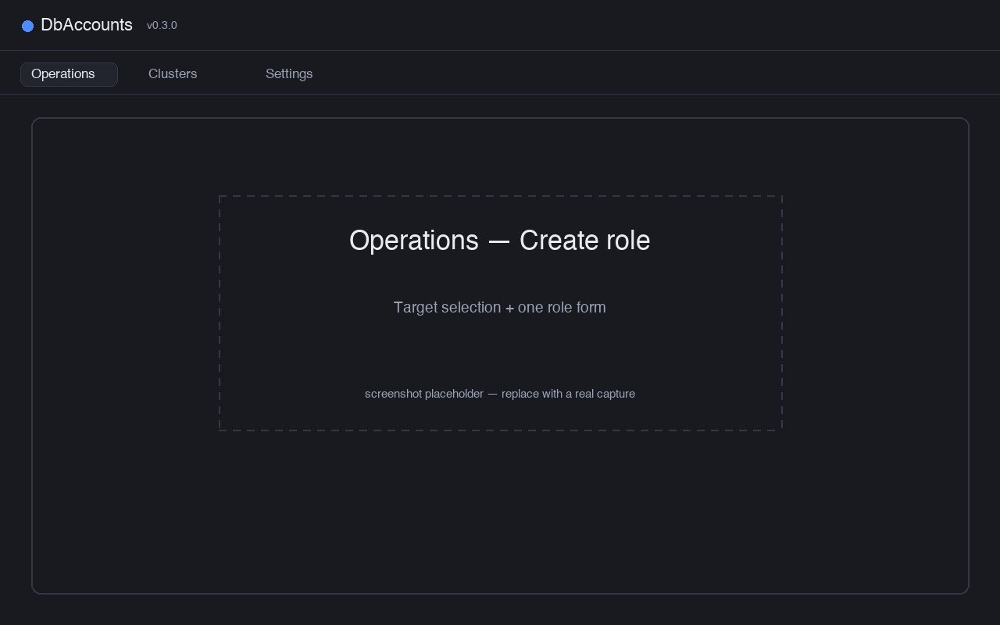

DbAccounts is a desktop app for maintaining **PostgreSQL roles across many clusters**.
You keep a list of clusters (grouped, for example, into Production and UAT), pick which
ones to act on, and create or change a role on all of them from a single form. The role
change is applied to each cluster in one transaction, and you see a per-cluster result.

The app does not hard-code any DDL. Every change — create, drop, grant, revoke, password,
comment, attribute, setting — runs through a **SQL call template** you can read and edit.
The defaults are plain PostgreSQL statements; you can point any of them at a wrapper
function or view so a low-privilege connection can act through it.

:::note[Requirements]{icon="information"}

- A reachable PostgreSQL server (or several) that the connecting user can act on.
- Credentials come from the cluster's own user and optional password, the `PG*` environment
  variables, or `~/.pgpass` — resolved in that order, like `psql`.

:::

## What it does

- **Group clusters** and pick targets. A cluster belongs to a group (for example Production, UAT);
  each group has a colour and an optional *require confirmation* flag. You select whole
  groups and/or individual clusters, and that selection is remembered between sessions.
- **Create a role** on every selected cluster at once — login name, and (via your template)
  parent roles and the configured comment fields (full name, email, …).
- **Alter a role** by searching for it first, then editing its whole identity in one form:
  parent-role memberships, attributes (superuser, create role, create DB, inherit, login,
  replication, bypass RLS), settings (role-level `GUC`s such as `statement_timeout`),
  comment, password, and which clusters it exists on.
- **See where things differ.** When a role's memberships, settings, or comment vary across
  clusters, the app shows that per cluster and lets you reconcile it, rather than hiding the
  difference.
- **Edit the SQL.** Each operation's template and execution mode live in Settings. A
  **Default** button reverts any template to the built-in plain-SQL version.
- **Confirm before production.** Runs that touch a group flagged *require confirmation* stop
  at a dialog first. Removing a role also asks for confirmation.

## How a change is applied

1. You choose the target clusters/groups in **Target selection**.
2. You make edits in the form (grants, attributes, settings, comment, password).
3. On **Save**, the app builds an ordered list of operations per cluster and runs each
   cluster's list as **one transaction** — commit on success, roll back on the first error.
4. Each cluster reports its own outcome (and the exact SQL it ran) in a status panel; one
   unreachable or failing cluster does not stop the others.

## Where to go next

- [Installation](/pg-accounts-management/installation/) — download a build or install from source.
- [Usage](/pg-accounts-management/usage/) — target selection, scope labels, and how a change is applied.
- [Configuration](/pg-accounts-management/configuration/) — clusters, comment fields, templates, preferences.
- [Call templates](/pg-accounts-management/configuration/call-templates/) — how the editable SQL works.
- [Troubleshooting](/pg-accounts-management/troubleshooting/) — connection and permission issues.
