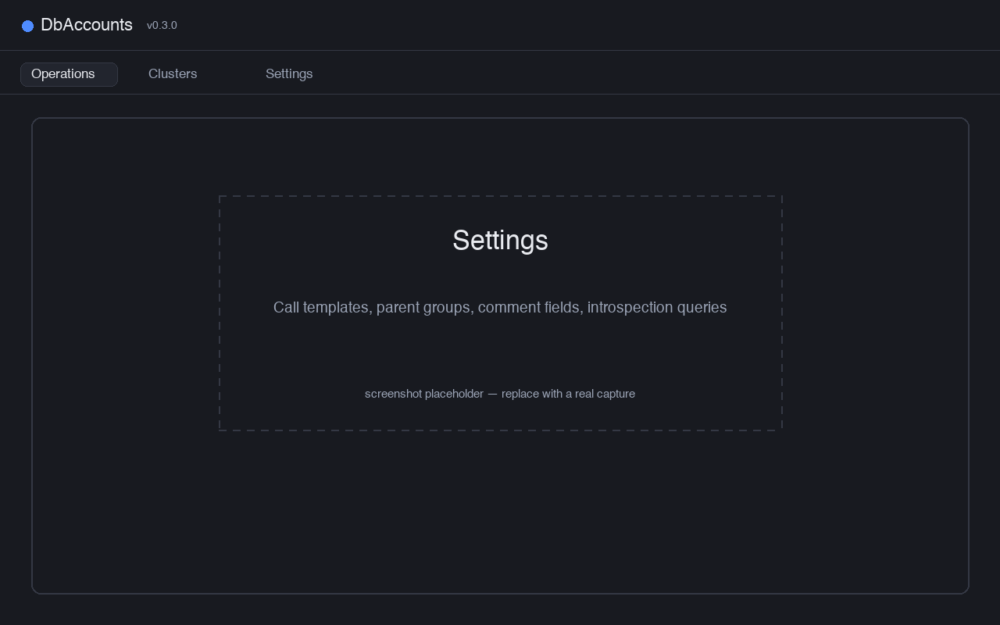

The app has three tabs — **Operations**, **Clusters**, and **Settings**. Operations is where
you create and alter roles; the other two hold configuration.

## Clusters and groups

Open the **Clusters** tab to define your clusters (alias, host, port, database, and group)
and your groups. Editing here is **staged**: adds, edits, and deletes change an on-screen
draft, and nothing is written until you press **Save** (or **Discard** to revert). The Save
button is active only when there are unsaved changes.

- **Cluster groups** are edited from the *Cluster groups* button in the Clusters toolbar. A
  group has a label, a base **colour**, and a **require confirmation** flag. The flag — not
  any special group name — is what gates a run behind a confirmation dialog, so you decide
  which groups count as production.
- **Test connections** checks every cluster and writes the result into a per-row status
  column. To test values you are still typing, use the test action inside the cluster editor.

## Target selection

On the **Operations** tab, the left sidebar is **Target selection**. Tick the groups you want,
or expand **Or pick clusters** to choose individual clusters. Everything you do on this
tab — searching, creating, altering — applies to exactly this selection, and the selection is
remembered between sessions.

## Create a role

Click **Create role** (top-right of the tab bar while Operations is active). Enter a login
name and fill in the form — comment, parent roles, attributes, and settings as needed. Then
press **Create role** at the bottom.

The app runs a `CREATE ROLE` (via the `create_role` template) on every selected cluster,
followed by whatever else you set on the form, as one transaction per cluster. Before it
runs, it checks the login name and warns if the role already exists somewhere.

## Alter a role

Altering starts with a search, so you never act on a mistyped name.

1. Choose the clusters/groups to compare in **Target selection**, then click **Alter role**
   and type at least two characters. Only the selected clusters are searched (in parallel),
   and the term is matched against the role name **and** its `COMMENT ON ROLE`. Results are
   grouped by login name; unreachable clusters are reported but don't stop the search.
2. Pick a role to open **one form** for its whole identity — not one form per cluster.

### Scope labels

Anywhere clusters are listed (Present on, privileges, attributes, comments), the app uses the
same **scope labels**, coloured by group. Completeness is judged per group relative to your
selection:

- if **every** selected cluster in a group matches, you see one filled group label (for example `PRODUCTION`);
- otherwise you see one label per matching cluster (for example `PRODUCTION` plus `UAT-1`), so a
  partial match is never hidden behind a group name.

### Privileges, attributes, and settings

These are listed one per row — the name on the left, the scope on the right.

- **Privileges** are parent-role memberships (read from `pg_auth_members`).
- **Attributes** are the role flags: superuser, create role, create DB, inherit, login,
  replication, bypass RLS.
- **Settings** are role-level `GUC`s (from `pg_roles.rolconfig`), such as
  `statement_timeout` or `log_statement`. A setting can hold a different value on different
  clusters.

Each row has three actions:

- **✎ Edit** — open a per-cluster checkbox editor that both **grants and revokes**. Pending
  grants show green; pending revokes show struck through.
- **×** — remove everywhere.
- **↺** — discard pending changes on that row.

Use **Add privilege…** / **Add setting…** to introduce a new membership or setting on any mix
of groups and clusters.

### Present on

The **Present on** block shows which clusters the role exists on, plus pending additions
(green) and removals (struck through). The **✎** button next to the title opens a picker to
add the role to clusters it's missing from, or drop it from some. Adding a cluster brings the
whole form to bear on it (a `CREATE ROLE` is prepended on Save); dropping one records a
`DROP ROLE` for that cluster.

### Comments

A role's comment can be plain text or JSON. When comments differ across clusters, the inline
editor is replaced by a **Comments** dialog that groups clusters by comment content (JSON is
compared by value, so formatting and key order don't count as a difference). You can edit a
version and apply it to all of that group's clusters, or broadcast one version to every
cluster. Nothing is written until you Save.

### Password and remove

- **Change password** applies to every cluster where the role exists.
- **Remove role** is a separate red button that drops the role on every cluster it exists on,
  after a confirmation.

### Save and results

**Save changes** computes the per-cluster diff and applies it — grants, revokes, password,
attributes (combined into one `ALTER ROLE … WITH …`), settings, and comment — as one
transaction per cluster. Progress shows live in a status chip at the bottom; click it to open
a per-cluster panel with each cluster's status, duration, message, and the exact SQL it ran.

If any cluster fails or is unreachable, the form and your pending edits are left untouched, so
you can retry. Only a fully clean run refreshes the form from the database.

## Confirmation and safety

- Groups flagged **require confirmation** produce a confirmation dialog before anything runs.
- **Remove role** always asks first.
- Each cluster's change is its own transaction on its own connection, so clusters never
  interfere with each other.

## Settings

The **Settings** tab holds the editable pieces:

- **Call templates** — the SQL and execution mode for each operation (see
  [Call templates](/pg-accounts-management/call-templates/)).
- **Introspection queries** — the read queries behind Alter-role search and detail.
- **Preconfigured parent groups** — role names offered as quick picks when granting
  privileges.
- **Comment fields** — which JSON keys in a comment get friendly labels.
- **Appearance** and **max concurrency** (how many clusters a run touches at once).

