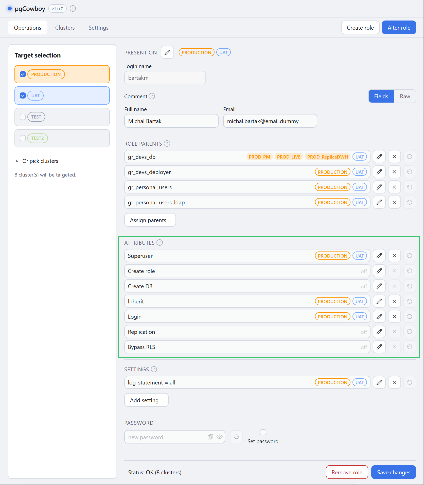
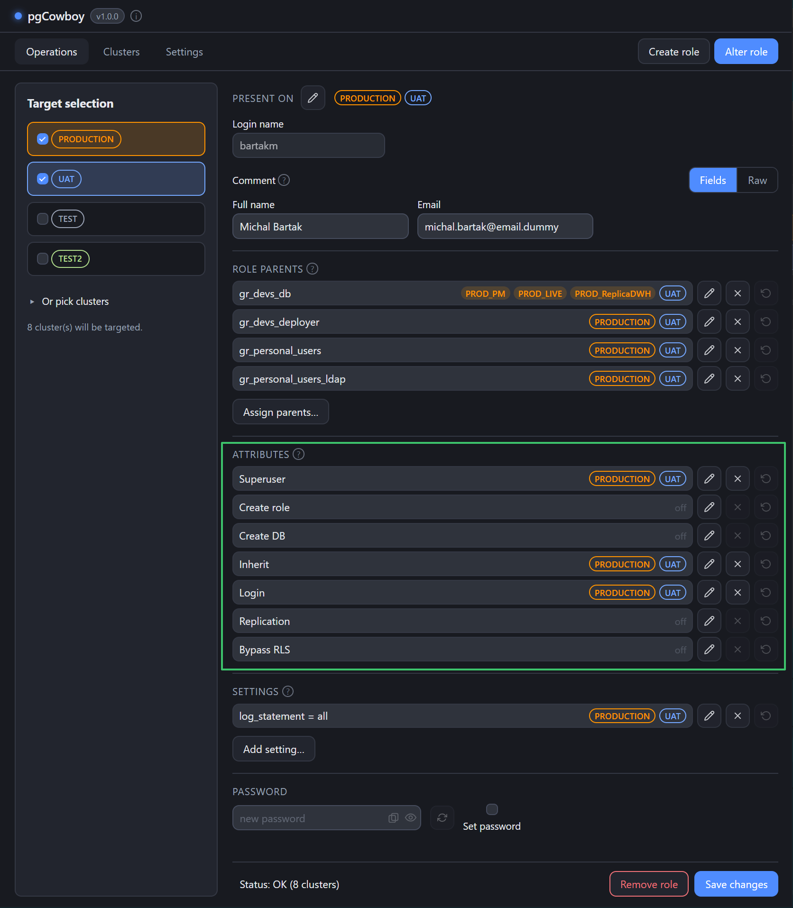
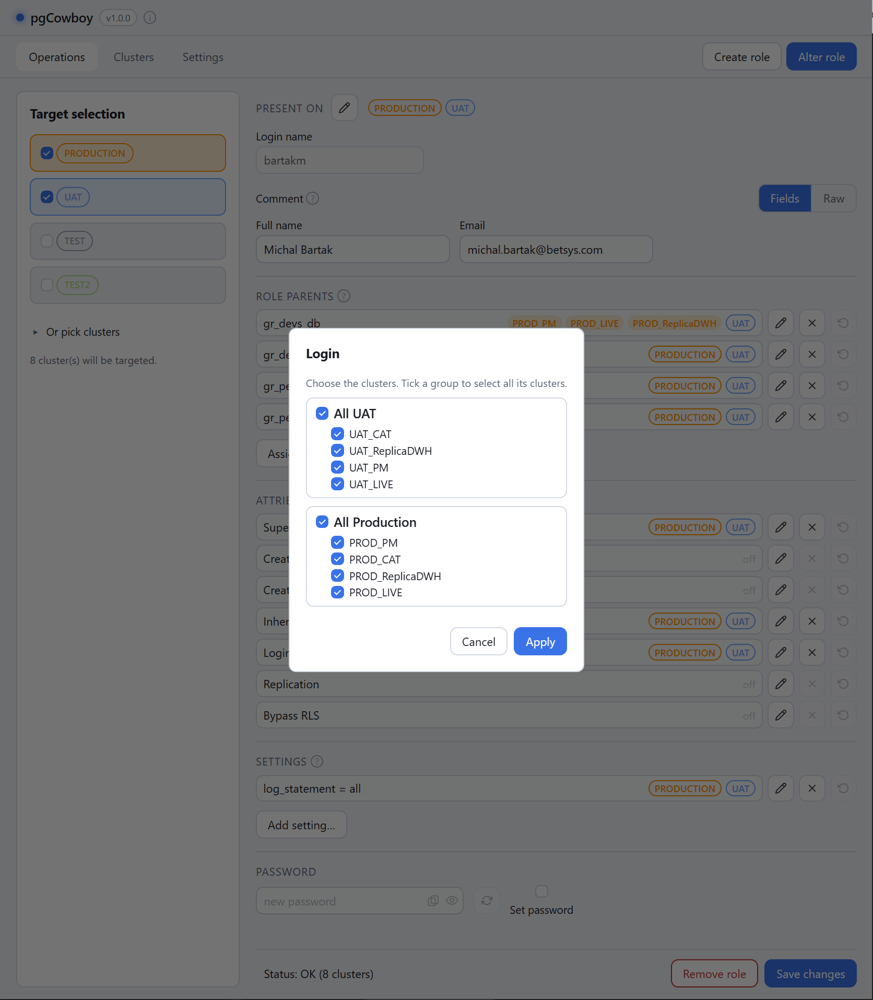
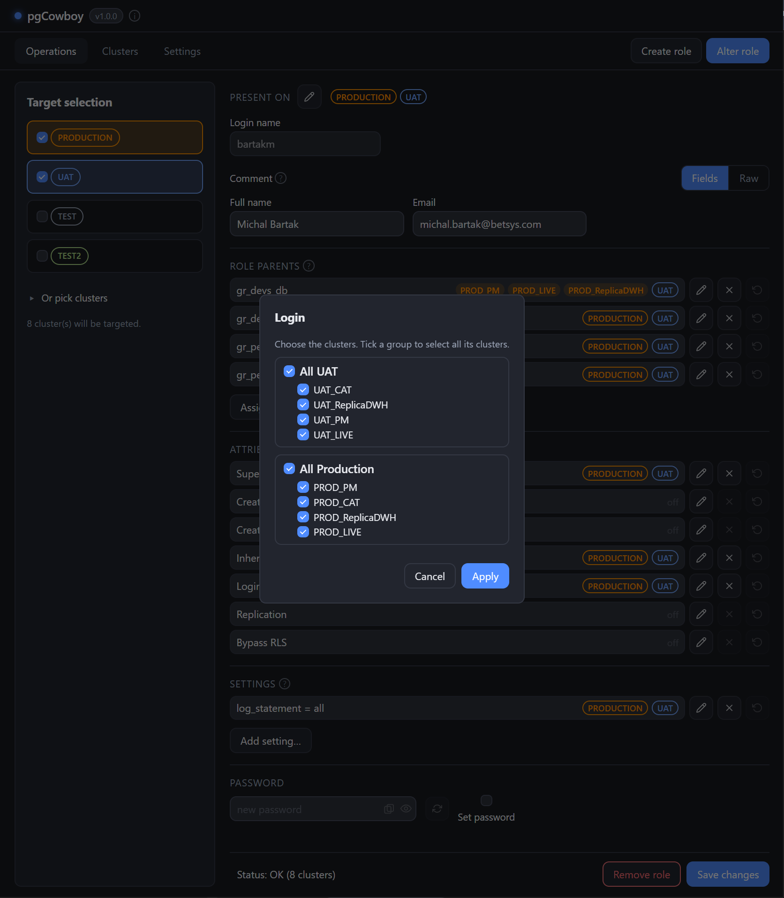

**Attributes** are PostgreSQL's role flags. They use the same rows and the same per-cluster
editor as [role parents](/pgcowboy/usage/parent-roles/).

<figure class="shot">

<figcaption>Attributes section — all seven flags with their scope labels</figcaption>
</figure>

| Attribute | Keyword |
|-----------|---------|
| Superuser | `SUPERUSER` / `NOSUPERUSER` |
| Create role | `CREATEROLE` / `NOCREATEROLE` |
| Create DB | `CREATEDB` / `NOCREATEDB` |
| Inherit | `INHERIT` / `NOINHERIT` |
| Login | `LOGIN` / `NOLOGIN` |
| Replication | `REPLICATION` / `NOREPLICATION` |
| Bypass RLS | `BYPASSRLS` / `NOBYPASSRLS` |

All seven rows always render, whether or not the flag is set. An attribute that is simply off looks neutral; only a **pending** change is marked, using the shared
[scope-label convention](/pgcowboy/usage/) — a pending enable is prefixed with
**`+`**, a pending disable turns **red and struck through**.

| Button | Effect |
|--------|--------|
| <svg class="doc-ic" viewBox="0 0 24 24" fill="none" stroke="currentColor" stroke-width="2" stroke-linecap="round" stroke-linejoin="round" aria-hidden="true"><path d="M21.174 6.812a1 1 0 0 0-3.986-3.987L3.842 16.174a2 2 0 0 0-.5.83l-1.321 4.352a.5.5 0 0 0 .623.622l4.353-1.32a2 2 0 0 0 .83-.497z"/><path d="m15 5 4 4"/></svg> **Edit** | Per-cluster editor — tick to enable, untick to disable. |
| <svg class="doc-ic" viewBox="0 0 24 24" fill="none" stroke="currentColor" stroke-width="2" stroke-linecap="round" stroke-linejoin="round" aria-hidden="true"><line x1="18" y1="6" x2="6" y2="18"/><line x1="6" y1="6" x2="18" y2="18"/></svg> **Remove** | Disables the attribute on every cluster in scope. |
| <svg class="doc-ic" viewBox="0 0 24 24" fill="none" stroke="currentColor" stroke-width="2" stroke-linecap="round" stroke-linejoin="round" aria-hidden="true"><polyline points="1 4 1 10 7 10"/><path d="M3.51 15a9 9 0 1 0 2.13-9.36L1 10"/></svg> **Discard** | Discards pending changes on that row. |

Click on Edit button opens the popup with selection of clusters

<figure class="shot">

<figcaption>Attributes section — all seven flags with their scope labels</figcaption>
</figure>

Pending changes are visible before you save, through the shared scope-label convention: a pending grant is prefixed with +, a pending revoke turns red and struck through.

When executing all of a cluster's attribute changes are combined into a single
`ALTER ROLE … WITH keyword keyword …`, so enabling `LOGIN` and disabling `SUPERUSER` turns into single statement, not two.
