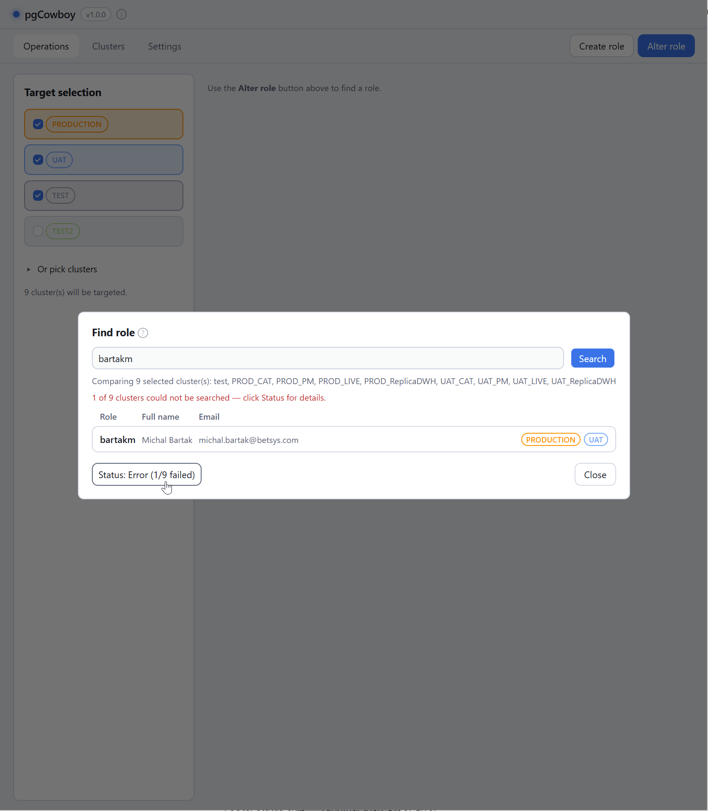
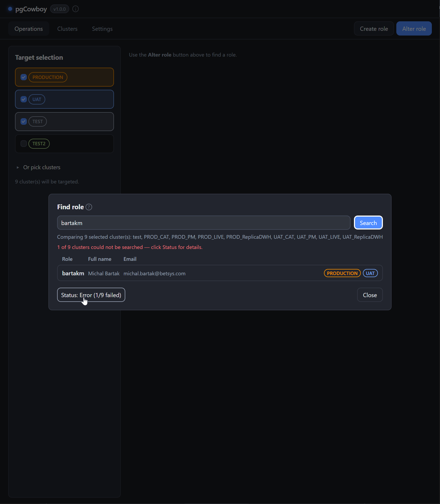
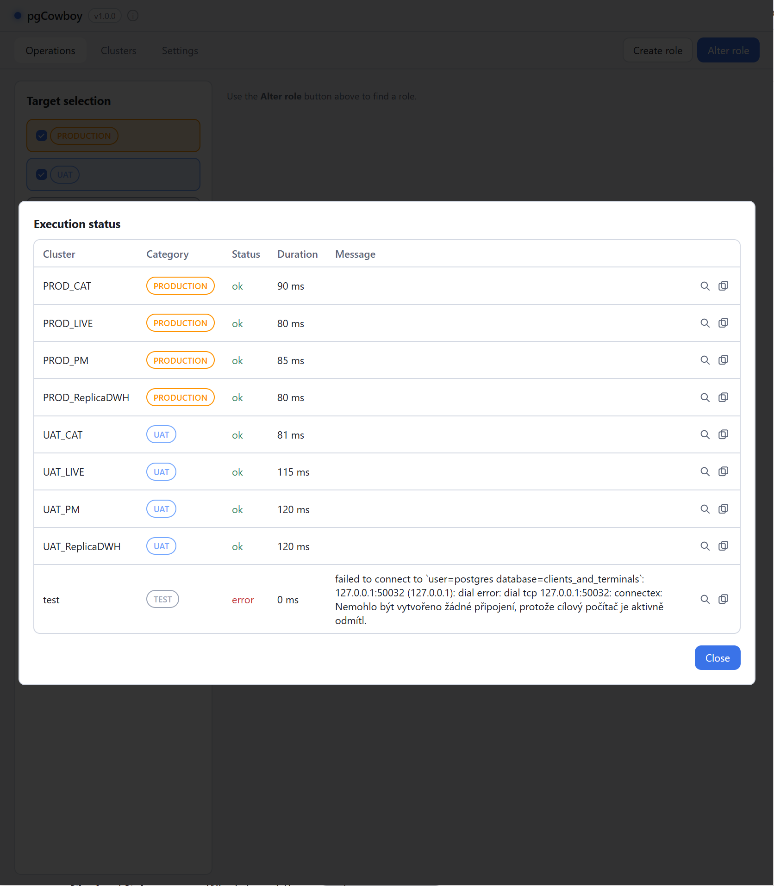
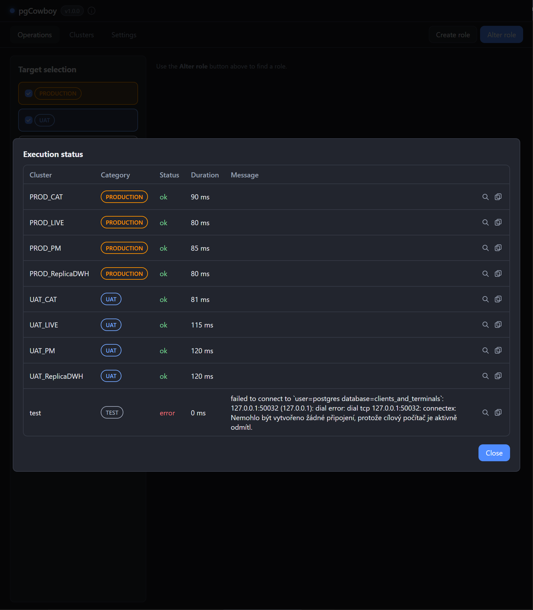
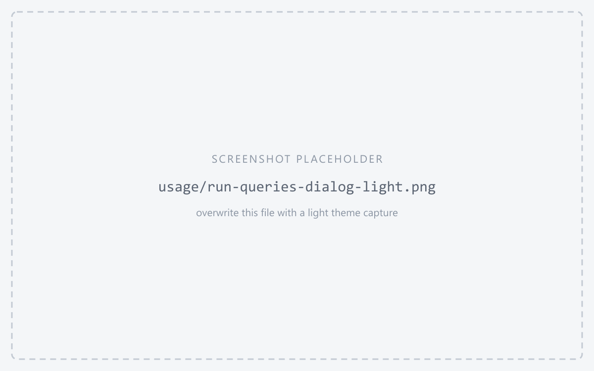
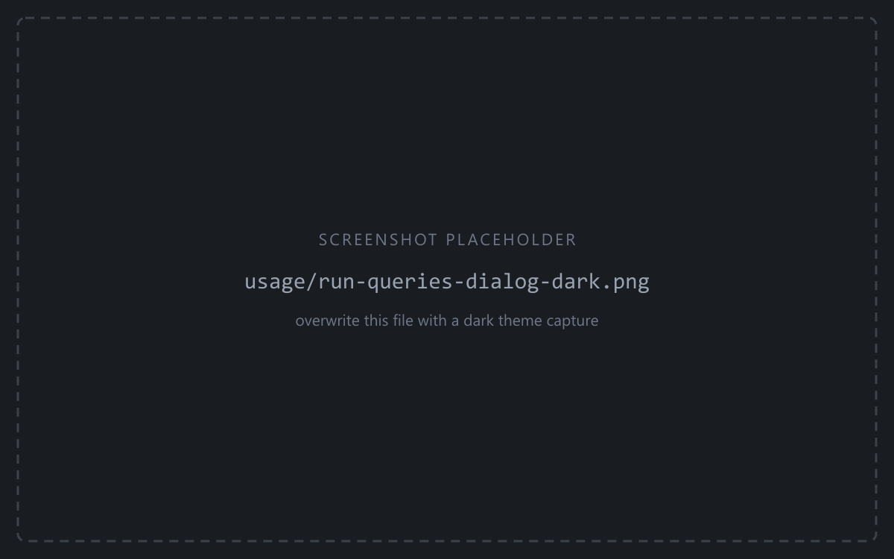

Results don't appear in the form. They go to the **status chip** in the footer, next to the action buttons.

<figure class="shot">

<figcaption>Footer status chip — running, then OK or Error</figcaption>
</figure>

The chip is hidden until something runs, then shows `running… (done/total)` and settles on **OK** or **Error**. It updates live, one step per cluster.

:::tip
The chip also reports **role loads**, so a cluster that was unreachable while reading the role is surfaced the same way as a failed write.
:::

## Per-cluster results

Click the chip to open the results panel. It fills in while the run is still going.

<figure class="shot">

<figcaption>Results panel — one row per cluster: Cluster, Category, Status, Duration, Message</figcaption>
</figure>

| Column | Notes |
|--------|-------|
| **Cluster** / **Category** | Which target the row is for. |
| **Status** | Per cluster. One failure doesn't hide the others' success. |
| **Duration** | How long that cluster took. |
| **Message** | The error text, naming the operation that failed. |

Each row has two actions:

| Button | Effect |
|--------|--------|
| <svg class="doc-ic" width="1.05em" height="1.05em" viewBox="0 0 16 16" fill="none" stroke="currentColor" stroke-width="1.5" stroke-linecap="round" stroke-linejoin="round" aria-hidden="true"><circle cx="7" cy="7" r="5"/><line x1="10.5" y1="10.5" x2="15" y2="15"/></svg> **View** | Opens the SQL that ran on that cluster. |
| <svg class="doc-ic" width="1.05em" height="1.05em" viewBox="0 0 16 16" fill="none" stroke="currentColor" stroke-width="1.5" stroke-linecap="round" stroke-linejoin="round" aria-hidden="true"><rect x="5" y="1" width="10" height="11" rx="2"/><rect x="1" y="4" width="10" height="11" rx="2"/></svg> **Copy** | Puts the cluster's message and all of its SQL on the clipboard. |

## The SQL that ran

The view button opens the statements the app sent to that cluster, in order.

<figure class="shot">

<figcaption>Executed SQL for one cluster, with its own Copy button</figcaption>
</figure>

- The SQL is the real thing, after placeholder substitution — including a failing statement's, which is recorded before the error.
- Function-mode bind values are inlined so the statement reads as executed.
- Role-load rows show the introspection queries instead.
- Passwords are not included.

:::caution
The log is cleared when you switch tabs.
:::
