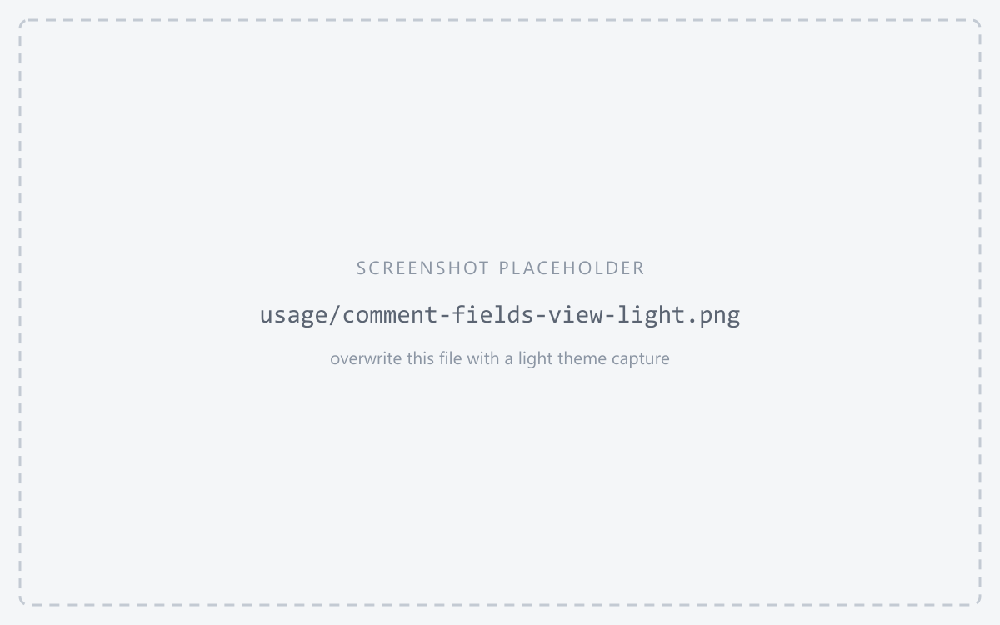
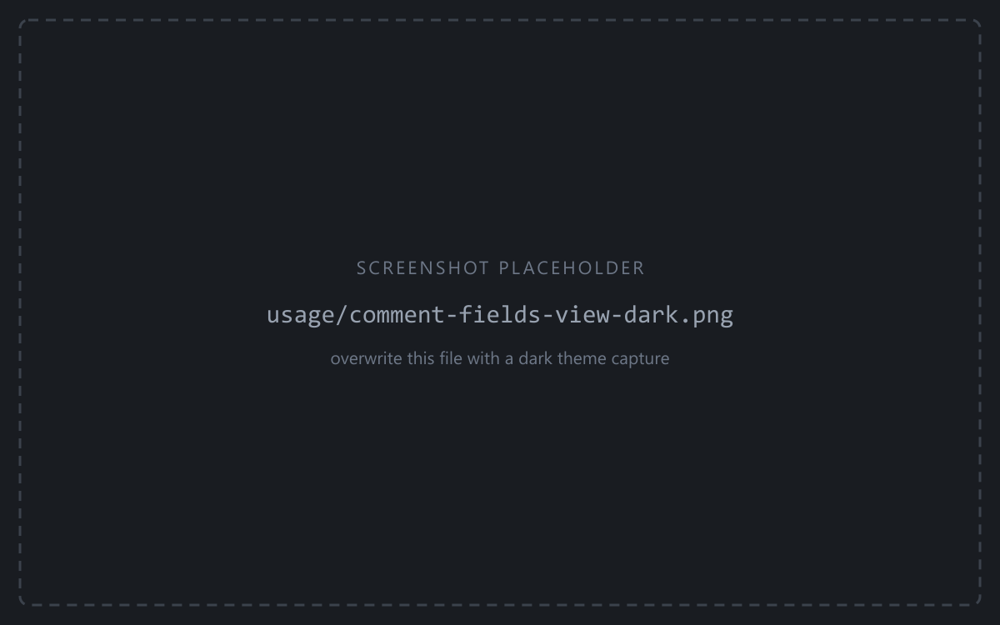
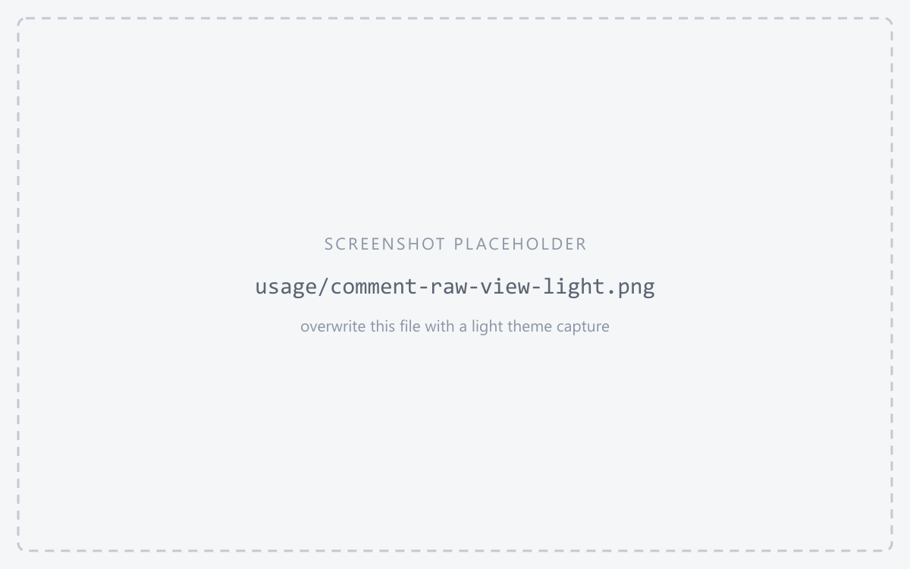
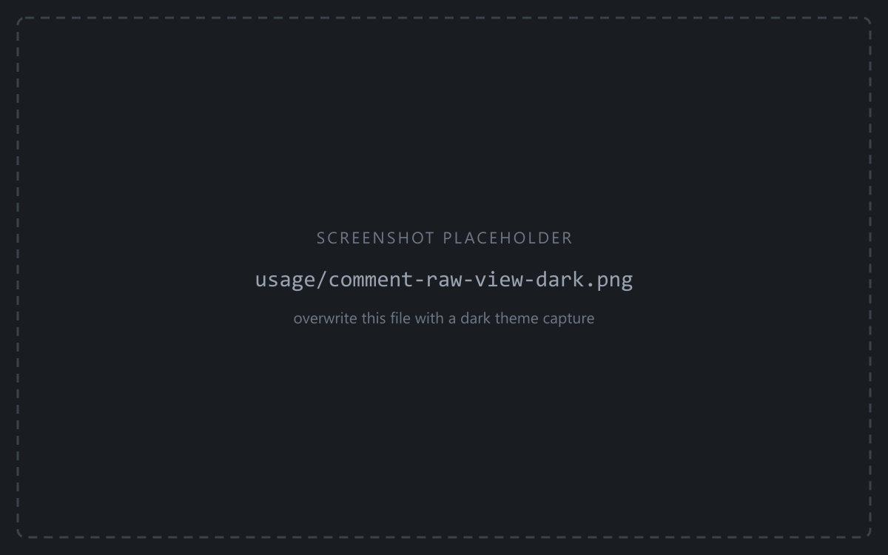
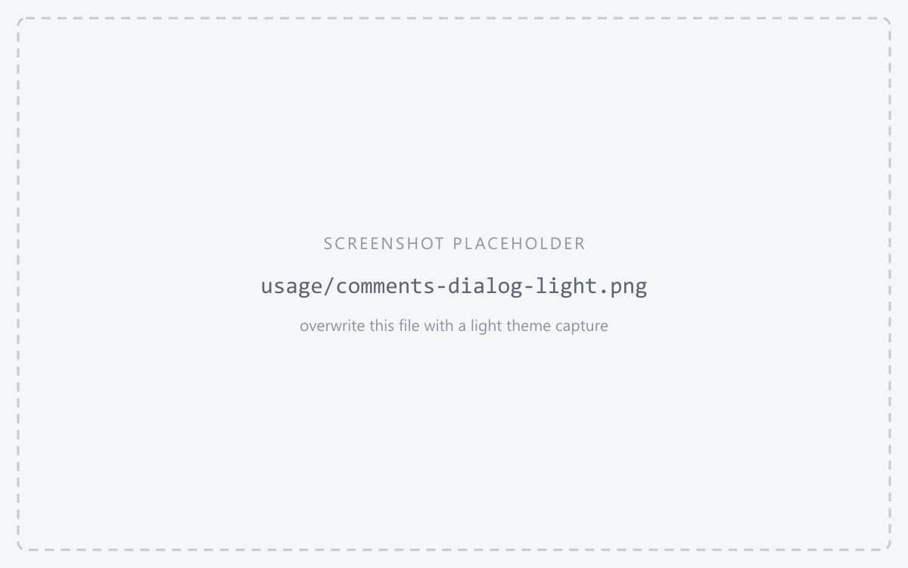
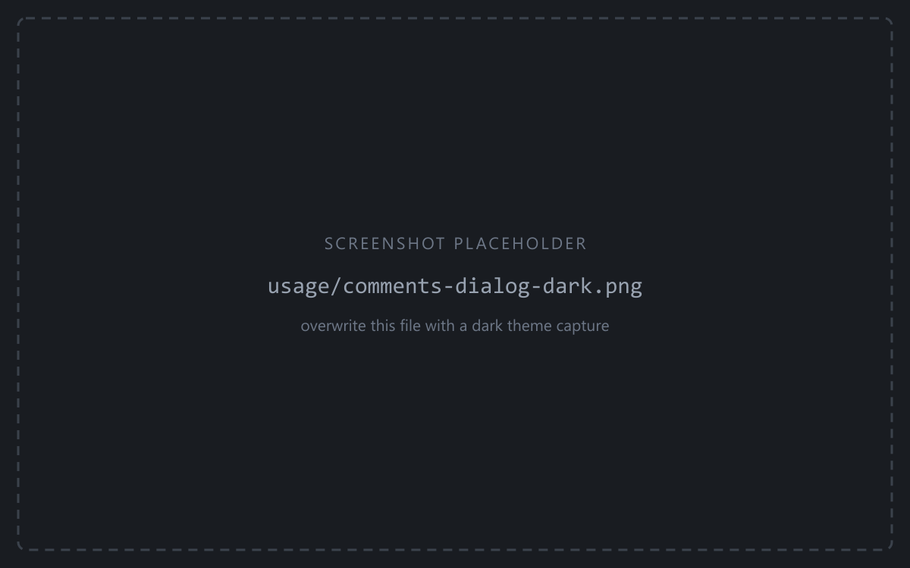

A role's comment is stored by `COMMENT ON ROLE`. The app treats it as **format-agnostic** —
plain text or arbitrary JSON, with no keys forced on you.

## The inline editor

The comment editor sits under the login name, with a **Fields ↔ Raw** toggle.

<figure class="shot">

<figcaption>Comment editor, Fields view — configured fields plus an extra key labelled by its raw name</figcaption>
</figure>

- **Fields** — one labelled input per JSON key. It edits values only; it never adds or removes
  keys. Which keys get friendly labels comes from
  [Comment fields](/pg-accounts-management/configuration/comment-fields/), and any other key in
  the comment still appears, labelled by its raw key.
- **Raw** — the whole comment as free text. Use it to add or remove keys, to write plain text,
  or to edit a value that Fields shows read-only.

<figure class="shot">

<figcaption>Comment editor, Raw view</figcaption>
</figure>

Details worth knowing:

- Non-string values (number, boolean, array, object) are **read-only** in Fields, so their type
  is preserved. Edit them in Raw.
- Clearing a field that already existed stores JSON `null`; a key that was never there stays
  absent. An entirely blank comment saves as empty.
- The **Fields** toggle is disabled when the comment is non-empty plain text — Fields can't
  represent it, and switching would drop it. Edit that comment in Raw.
- A non-JSON comment is saved verbatim as plain text.

## When comments differ across clusters

If the same role carries different comments on different clusters, the inline editor is
replaced by a **Comments differ** banner. Reconciliation moves to the **Comments** dialog.

<figure class="shot">

<figcaption>Comments dialog — one editor per distinct comment, grouped by content</figcaption>
</figure>

- Clusters are grouped by comment content. JSON is compared **by value**, so formatting and key
  order don't count as a difference.
- Each version gets its own Fields/Raw editor.
- **Use in all clusters** broadcasts one version to every other version box.
- **OK** stages your edits; **Cancel** discards them. Nothing is sent from the dialog.
- If the versions end up identical, OK folds them back into the inline editor and the banner
  clears.

Staged comments publish with everything else on **Save changes**.
