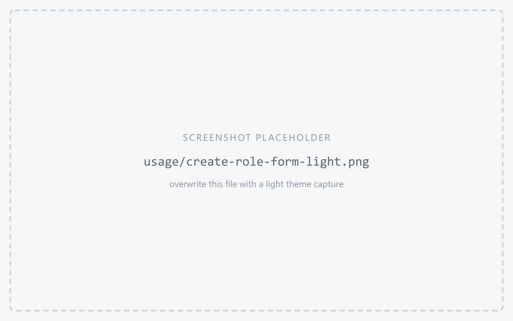
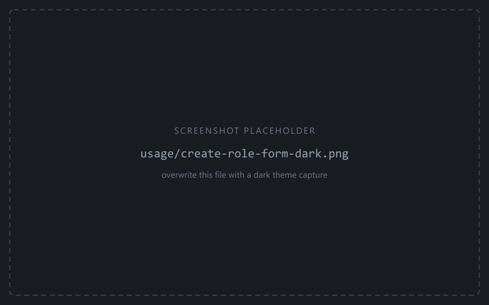
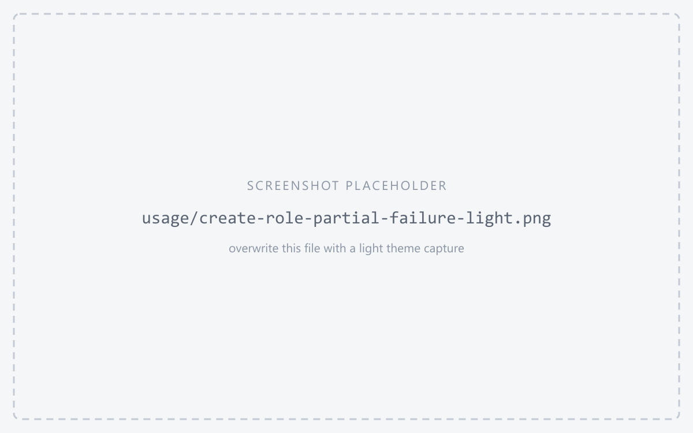
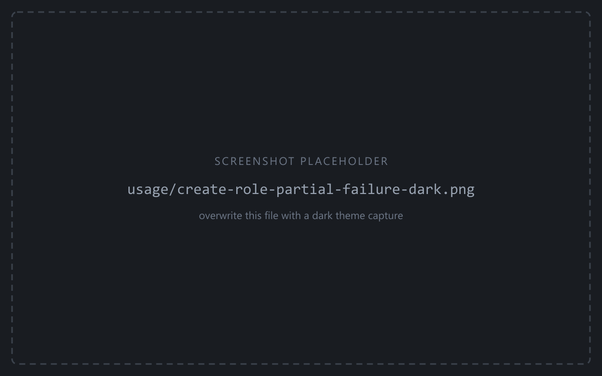

Click the **Create role** tab. The form resets to an empty role over the clusters currently
selected in **Target selection**.

<figure class="shot">

<figcaption>Create role form</figcaption>
</figure>

It is the same form as Alter, over an empty baseline: every edit is a grant, an enable, or a
set. Fill in what you need:

| Part | Notes |
|------|-------|
| **Login name** | Required. The only field you must fill. |
| **Comment** | Comment deployed to all clusters, in [Fields or Raw](/pgcowboy/usage/comments/) mode. |
| **Role Parents** | The [roles it becomes a member of](/pgcowboy/usage/parent-roles/) on each cluster/group. |
| **Attributes** | The [role flags](/pgcowboy/usage/attributes/), per cluster. |
| **Settings** | Role-level [parameters](/pgcowboy/usage/role-settings/), per cluster. |
| **Password** | Tick [Set password](/pgcowboy/usage/password/) to set one at creation. |

Adding a target re-synthesises the form, keeping the edits you've already made. Removing a target works the same way, though the settings for the removed target are lost.

## Execution

Press the **Create role** button.

:::caution
If confirmation-flagged groups are involved, the app asks for confirmation.
:::

The app validates the login name and warns if the role already exists on any selected cluster.

Then `create_role`, followed by the parent grants, the password, the attributes, the settings and the comment, is issued against each involved cluster.

:::tip
All queries against a single cluster are issued within one transaction, so they either all succeed or all fail.
:::

### Execution failure

The status of every cluster's execution, including error messages, is available in the
[command log](/pgcowboy/usage/command-log/).

If a cluster fails, then:

- The failing cluster is **rolled back** — no half-created role.
- **Other clusters are unaffected.** Each commits its own transaction, so a run can succeed on some clusters and fail on others.

<figure class="shot">

<figcaption>Command log after a partial failure</figcaption>
</figure>

What happens next depends on how much got through:

- **Every cluster failed** — you stay on the Create form with your input intact. Fix the cause and press Create again.
- **At least one cluster succeeded** — the form hands off to **Alter role** with the new role loaded over the same clusters. The ones that failed appear as *not present* in [Present on](/pgcowboy/usage/presence/).

Either way the [command log](/pgcowboy/usage/command-log/) keeps the creation
results — the follow-up load is appended to it, not written over it.
