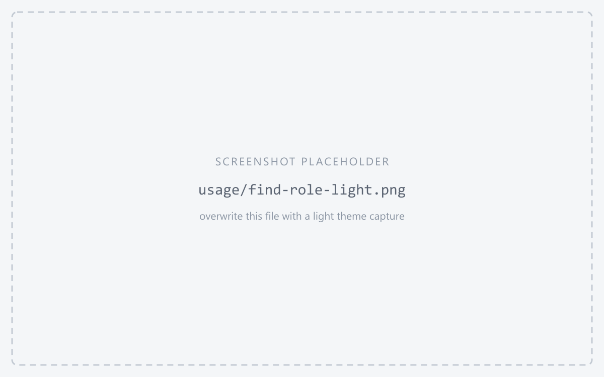
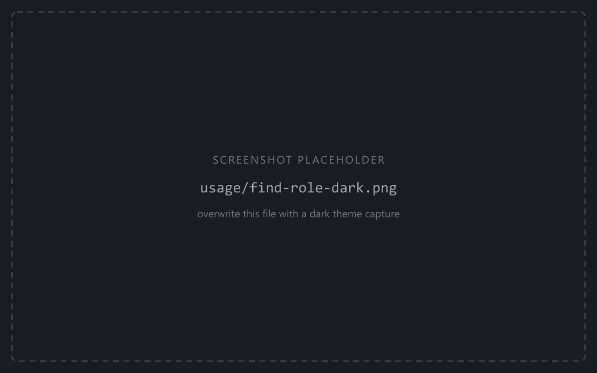
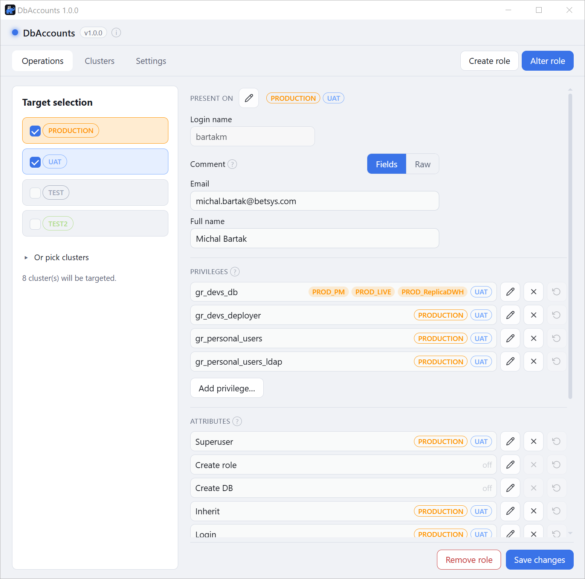
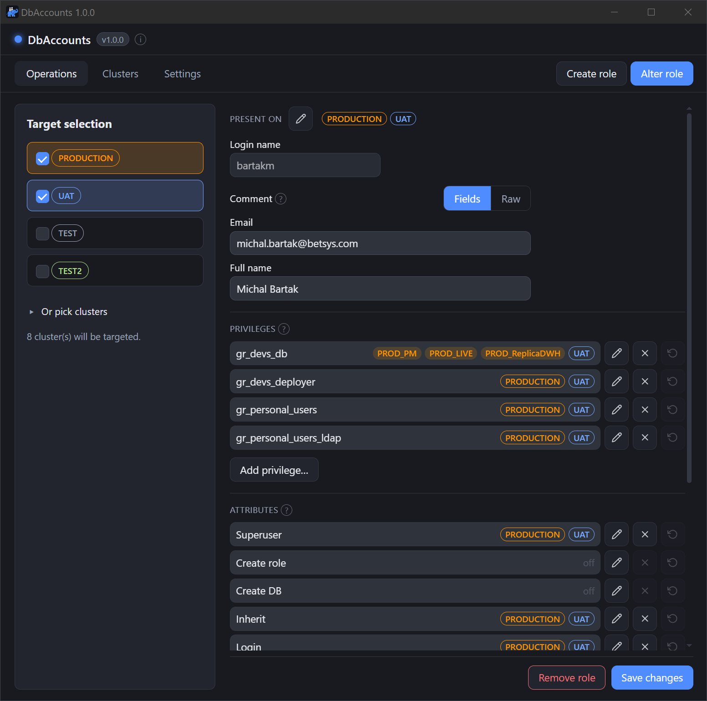

Altering starts with a search, so you never act on a mistyped name.

1. Set the clusters or groups you want to compare in **Target selection**.
2. Click the **Alter role** tab. The search dialog opens straight away.
3. Type at least two characters.

<figure class="shot">

<figcaption>Find role dialog — search box and results grouped by login name with scope labels</figcaption>
</figure>

## What is searched

- Only the **selected** clusters, queried in parallel.
- The term matches the **role name** and its `COMMENT ON ROLE`, so you can find a person by
  name or email if the comment holds it.
- Results are grouped by login name, with [scope labels](/pg-accounts-management/usage/)
  showing where each one exists.
- An unreachable cluster is reported but doesn't stop the search.

## Picking a role

Picking a result loads **one form** for the role's whole identity across those clusters — not
one form per cluster.

<figure class="shot">

<figcaption>Alter role — Present on, comment, privileges and attributes in one form</figcaption>
</figure>

The clusters selected at search time become the role's working scope. To bring another cluster
into play, re-select targets and search again.

From here you can edit the [comment](/pg-accounts-management/usage/comments/),
[privileges](/pg-accounts-management/usage/privileges/),
[attributes](/pg-accounts-management/usage/attributes/),
[settings](/pg-accounts-management/usage/role-settings/),
[password](/pg-accounts-management/usage/password/), and
[where the role exists](/pg-accounts-management/usage/presence/).
