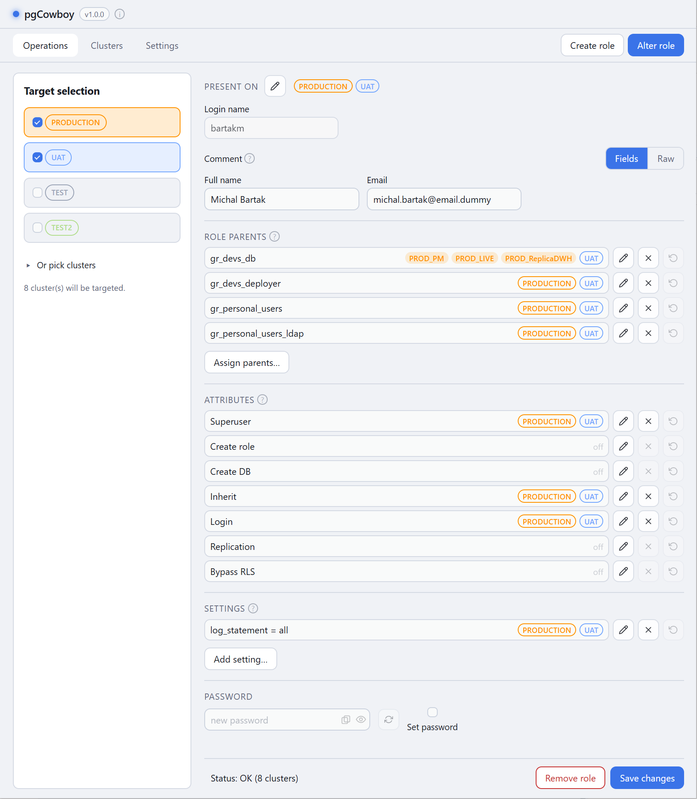
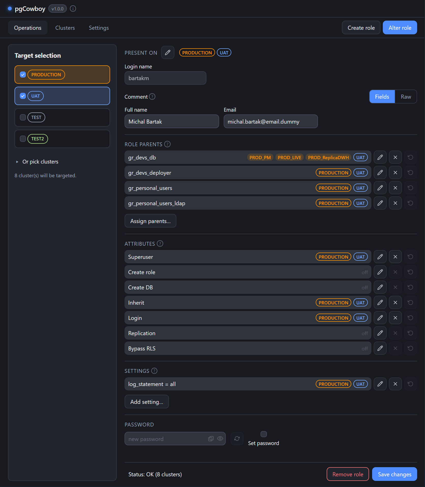

Altering starts with a search, so you always work with an existing role.

1. Set the clusters or groups you want to compare in **Target selection**.
1. Click the **Alter role** tab. The search dialog opens straight away.
1. Type at least two characters.
1. Press the **Search** button.
1. All matching roles are offered to select from.

:::tip
The result initially contains the rolename only. It can be extended with the role comment, or with selected JSON values found in the comment — see [Role Details](/pgcowboy/configuration/role-details/).
:::

<figure class="shot">

<figcaption>Find role dialog</figcaption>
</figure>

## What is searched

- Only the **selected** clusters, queried in parallel.
- The entered string is matched against role names and their comments (plain text). The SQL can be [adjusted to your liking](/pgcowboy/configuration/call-templates/).
- Results are grouped by login name, with [scope labels](/pgcowboy/usage/) indicating the role presence.
- An unreachable cluster is reported but doesn't stop the search.

## Operation status

The status of the operation is displayed at the bottom of the popup. It shows the number of successful and failed clusters; the per-cluster details are available after clicking on it. See also [Command log](/pgcowboy/usage/command-log/).

This status covers the **search** only. Once you pick a role, loading its details gets its own
status in the main window's bottom bar.

## Picking a role

Picking a result aggregates the data from all clusters into **one form**. The [scope labels](/pgcowboy/usage/) indicate where each individual setting appears — on a whole cluster group or on single clusters.

<figure class="shot">

<figcaption>Alter role form</figcaption>
</figure>

The clusters selected at search time become the role's working scope.

:::tip
You can bring another cluster into play, or remove one from the scope, by changing the selected targets.
:::

From here you can edit the [comment](/pgcowboy/usage/comments/),
[role parents](/pgcowboy/usage/parent-roles/),
[attributes](/pgcowboy/usage/attributes/),
[settings](/pgcowboy/usage/role-settings/),
[password](/pgcowboy/usage/password/), and
[where the role exists](/pgcowboy/usage/presence/).
