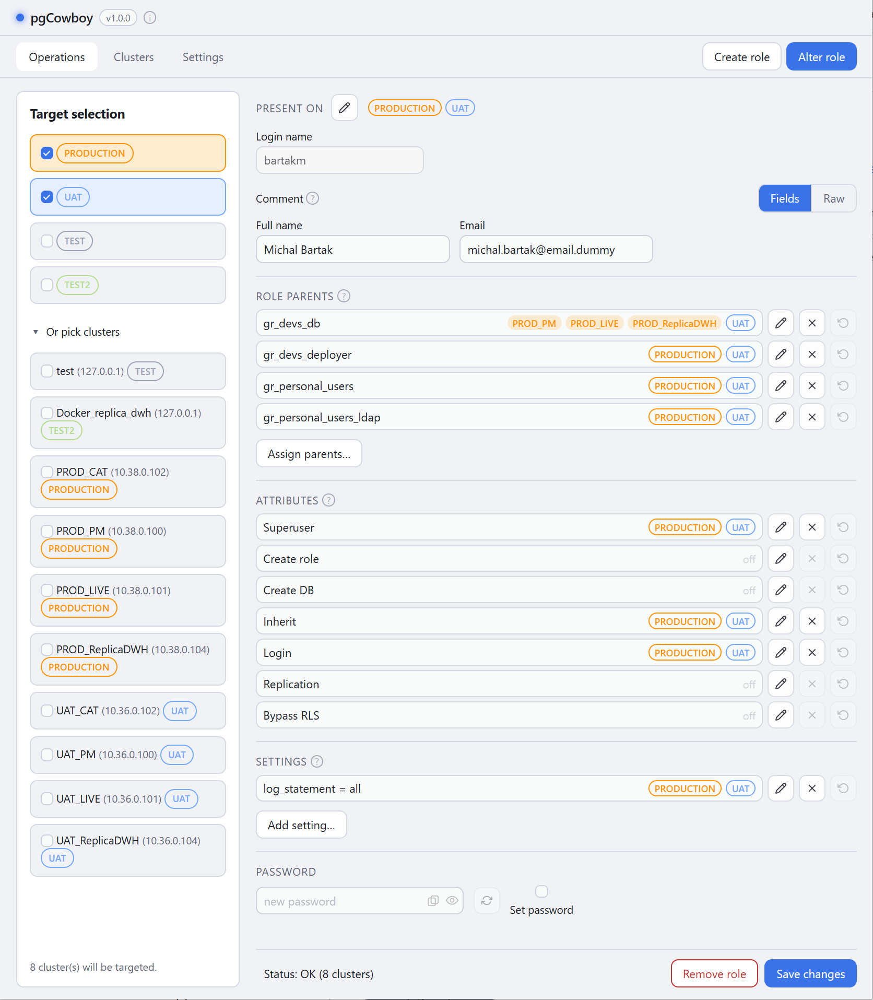
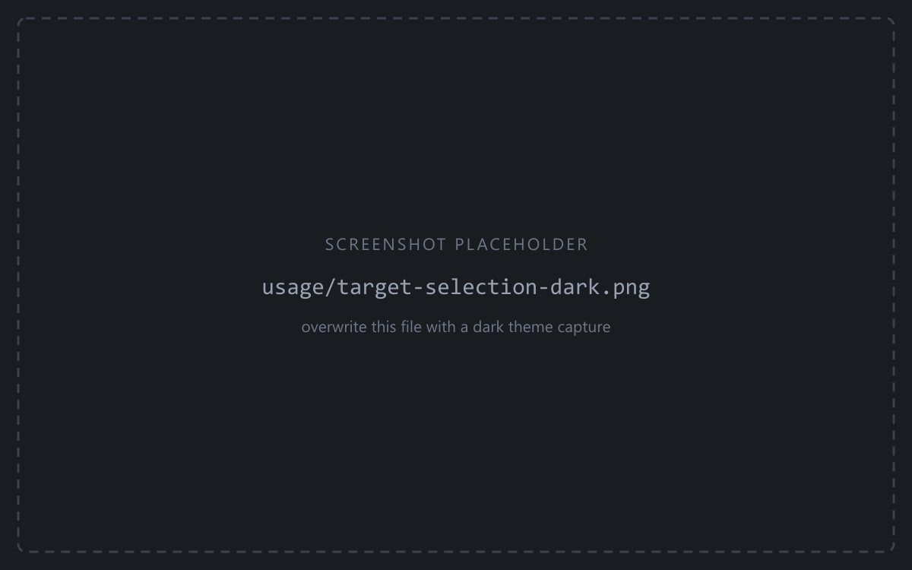
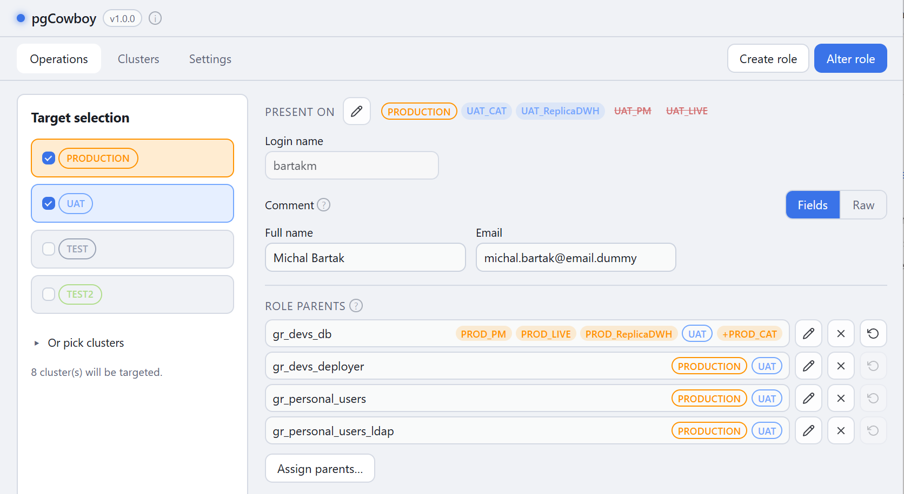
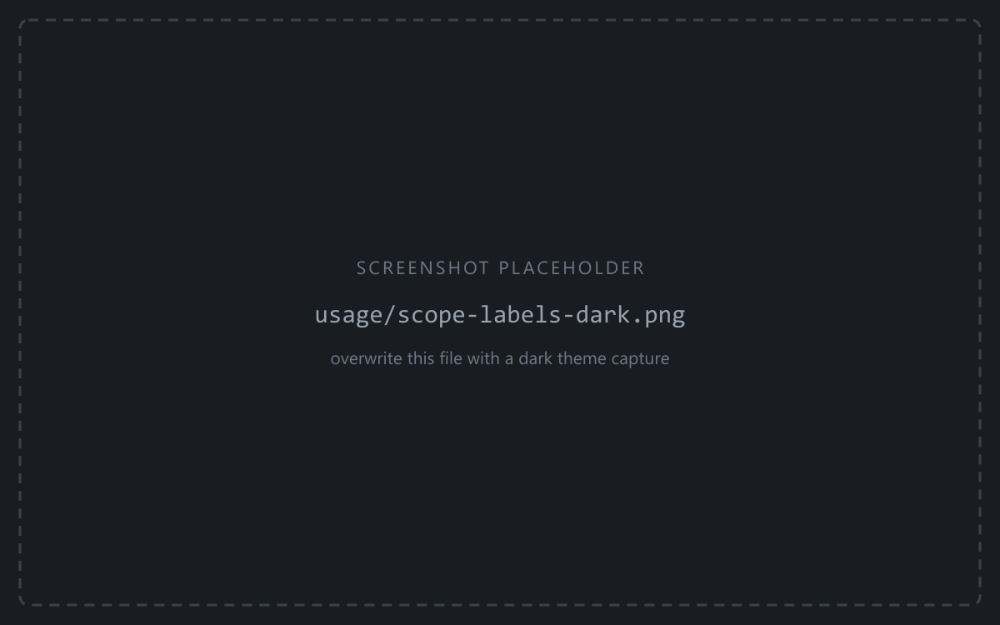
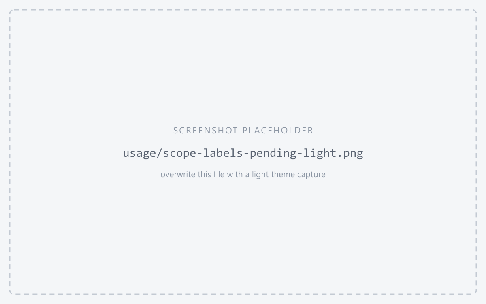
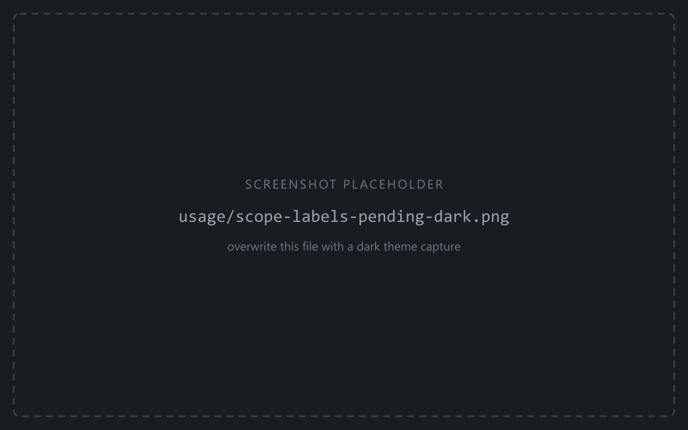

The **Operations** tab is where you create and alter roles. Its left sidebar picks the
targets; the right side is one form for the role.

<figure class="shot">

<figcaption>Operations tab — Target selection on the left, the role form on the right</figcaption>
</figure>

## Everything goes to the selected targets

There is no per-cluster form. Whatever you do on this tab — searching, creating, altering,
removing — applies to **exactly** the clusters selected in the sidebar.

<figure class="shot">

<figcaption>Target selection — group checkboxes and the expanded "Or pick clusters" list</figcaption>
</figure>

- Tick whole **groups**, or expand **Or pick clusters** to choose individual clusters.
- The selection is remembered between sessions.

The selection in force when you search becomes the role's **scope**. Everything the form then
shows and does is about those clusters, and nothing else. Widening the selection later doesn't
retroactively widen an open form — search again.

## Scope labels

Wherever clusters are listed — Present on, role-parent rows, attributes, settings, comments,
search results — the app uses the same labels, coloured by group:

<figure class="shot">

<figcaption>Scope labels — an outlined group label next to filled per-cluster labels</figcaption>
</figure>

- **Outlined label** (bordered, transparent) — *every* cluster of that group in scope matches.
  One label stands for the whole group, matching the bordered group boxes in Target selection.
- **Filled labels** (no border) — a partial match. You get one label per matching cluster, so
  a partial state is never hidden behind a group name.

### Pending changes

Labels also show edits you haven't saved yet:

<figure class="shot">

<figcaption>Scope labels — a pending addition prefixed with +, and a pending removal in red strikethrough</figcaption>
</figure>

- **Pending addition** — a leading **`+`** on the label. The colour doesn't change: the label
  keeps its group colour, so you can still tell where the addition lands.
- **Pending removal** — the label turns **red and struck through**, and drops its group colour.

Both are staged only. Nothing reaches a database until you Save.

## How a change is applied

1. You edit the form. Nothing is sent while you edit.
2. **Save changes** (or **Create role**) builds an ordered list of operations **per cluster**.
3. Each cluster's list runs as **one transaction** on its own connection — commit on success,
   roll back on the first error. Clusters never interfere with each other.
4. Progress and results appear in the [command log](/pg-accounts-management/usage/command-log/).

Runs that touch a group flagged **require confirmation** stop at a dialog first. Removing a
role always asks.

## Where to go next

- [Finding a role](/pg-accounts-management/usage/find-role/) — the search that starts every alter.
- [Creating a role](/pg-accounts-management/usage/creating-roles/) — the other entry point.
