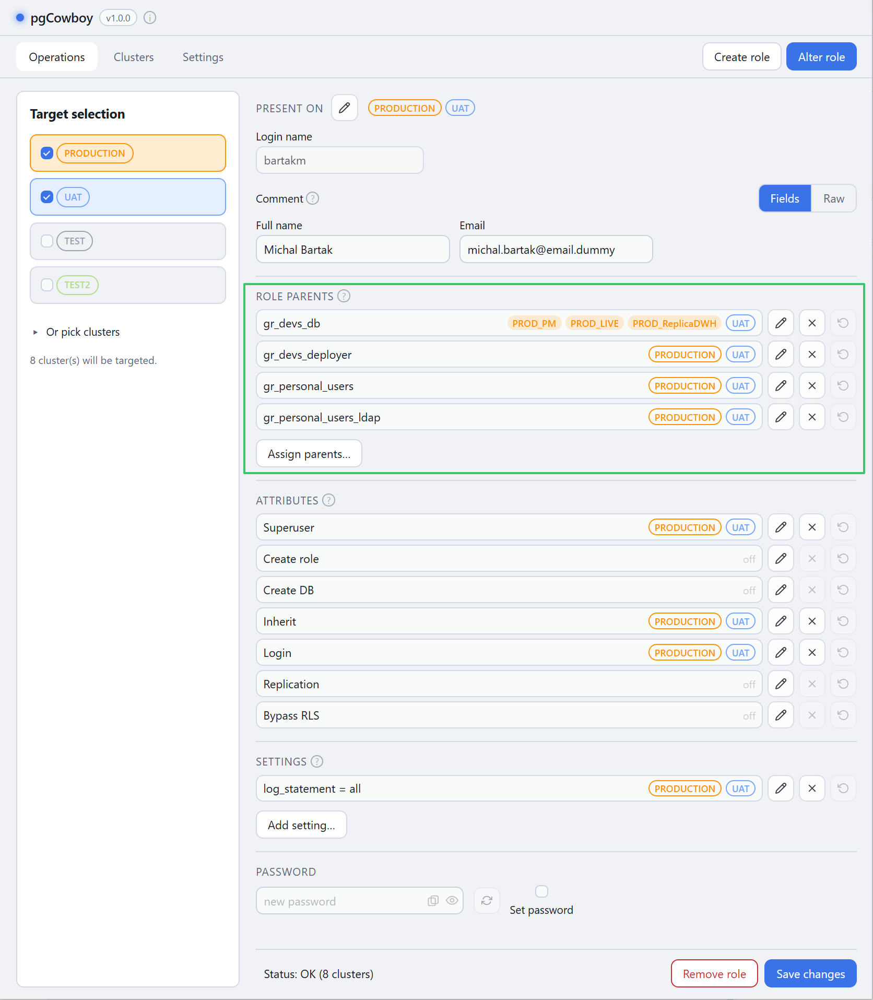
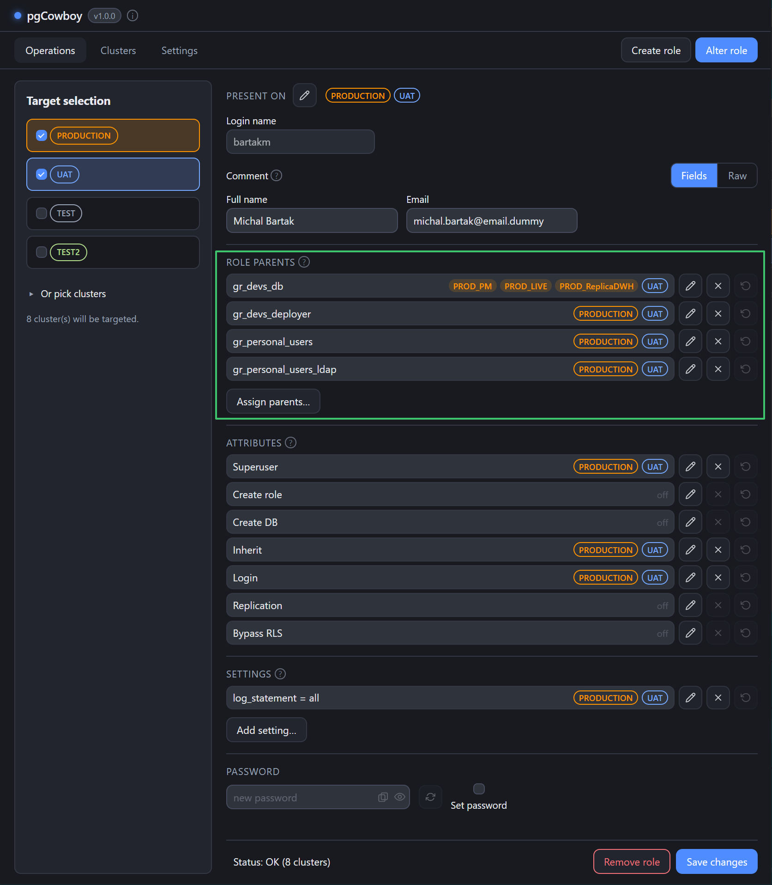
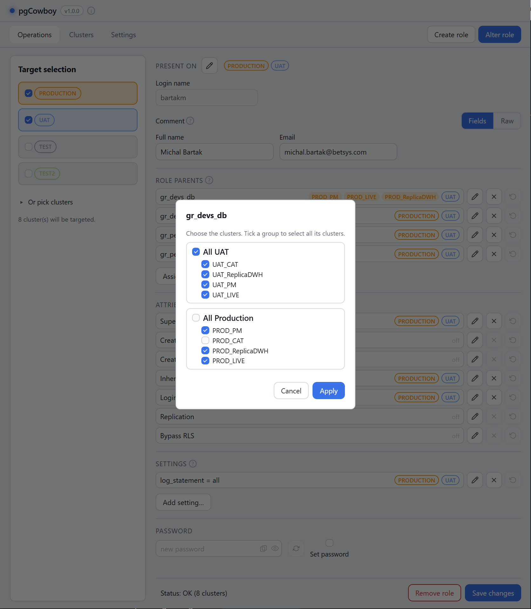
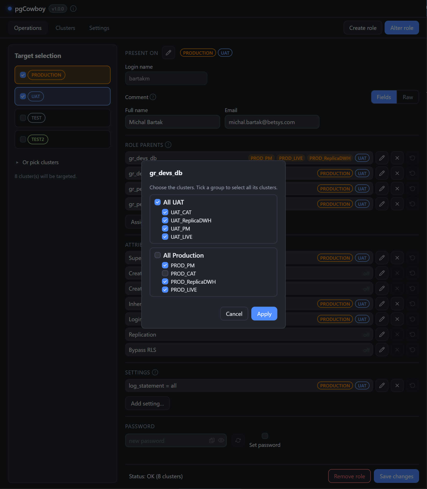
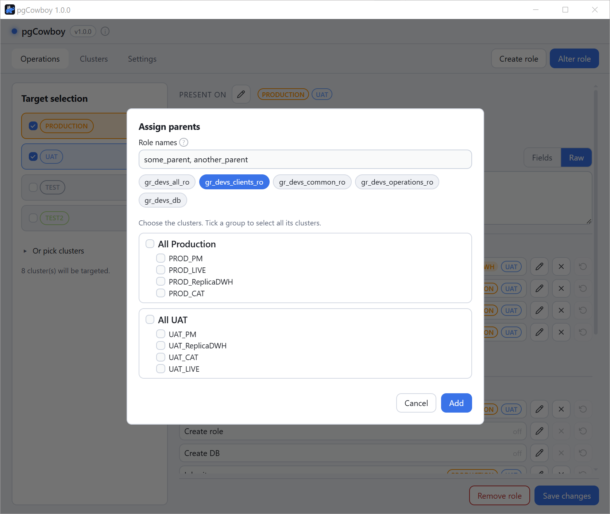
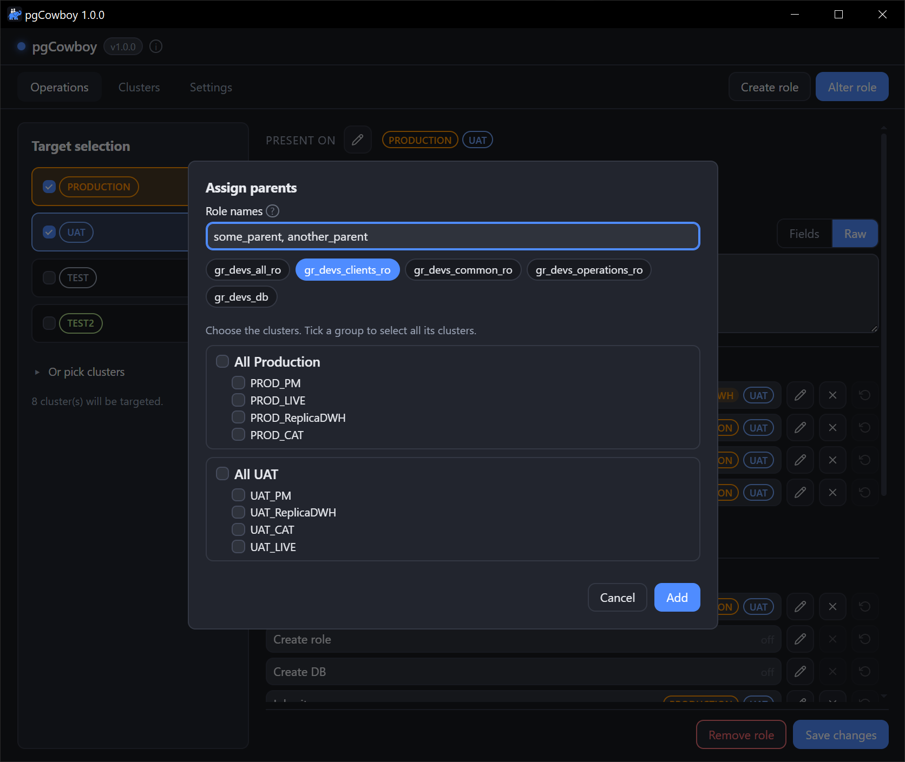

**Role Parents** are the roles this role is a member of. Each parent is one row: the name on the left, [scope labels](/pgcowboy/usage/) on the right showing where it is granted.

<figure class="shot">

<figcaption>Role Parents section — rows with scope labels and the three row actions</figcaption>
</figure>

## Row actions

Every row shows all three buttons. The ones that don't apply are greyed out.

| Button | Effect |
|--------|--------|
| <svg class="doc-ic" viewBox="0 0 24 24" fill="none" stroke="currentColor" stroke-width="2" stroke-linecap="round" stroke-linejoin="round" aria-hidden="true"><path d="M21.174 6.812a1 1 0 0 0-3.986-3.987L3.842 16.174a2 2 0 0 0-.5.83l-1.321 4.352a.5.5 0 0 0 .623.622l4.353-1.32a2 2 0 0 0 .83-.497z"/><path d="m15 5 4 4"/></svg> **Edit** | Opens a per-cluster editor that both grants and revokes. |
| <svg class="doc-ic" viewBox="0 0 24 24" fill="none" stroke="currentColor" stroke-width="2" stroke-linecap="round" stroke-linejoin="round" aria-hidden="true"><line x1="18" y1="6" x2="6" y2="18"/><line x1="6" y1="6" x2="18" y2="18"/></svg> **Remove** | Revokes on every cluster in scope. |
| <svg class="doc-ic" viewBox="0 0 24 24" fill="none" stroke="currentColor" stroke-width="2" stroke-linecap="round" stroke-linejoin="round" aria-hidden="true"><polyline points="1 4 1 10 7 10"/><path d="M3.51 15a9 9 0 1 0 2.13-9.36L1 10"/></svg> **Discard** | Discards pending changes on that row. |

The editor is one checkbox per cluster, showing the desired end state — tick to grant, untick to revoke. The app works out the difference from the current state.

<figure class="shot">

<figcaption>Per-cluster editor — checkboxes for the desired end state</figcaption>
</figure>

Pending changes are visible before you save, through the shared [scope-label convention](/pgcowboy/usage/): a pending grant is prefixed with **`+`**, a pending revoke turns **red and struck through**.

## Assigning parents

**Assign parents…** grants new memberships on any mix of groups and clusters. Two ways to name them, which combine freely:

- **Type the names** in *Role names*, separated by commas — `gr_devs_ro, app_ro`. Spacing around a comma doesn't matter, and repeats are collapsed.
- **Pick the chips** from [Preconfigured role parents](/pgcowboy/configuration/parent-roles/).

:::tip
Any role can be a parent, and several can be added at once.
:::

<figure class="shot">

<figcaption>Assign parents dialog — typed names, parent chips, and cluster selection</figcaption>
</figure>

On **Save changes** these become `grant_parents` and `revoke_parents` operations, folded into
each cluster's transaction.
