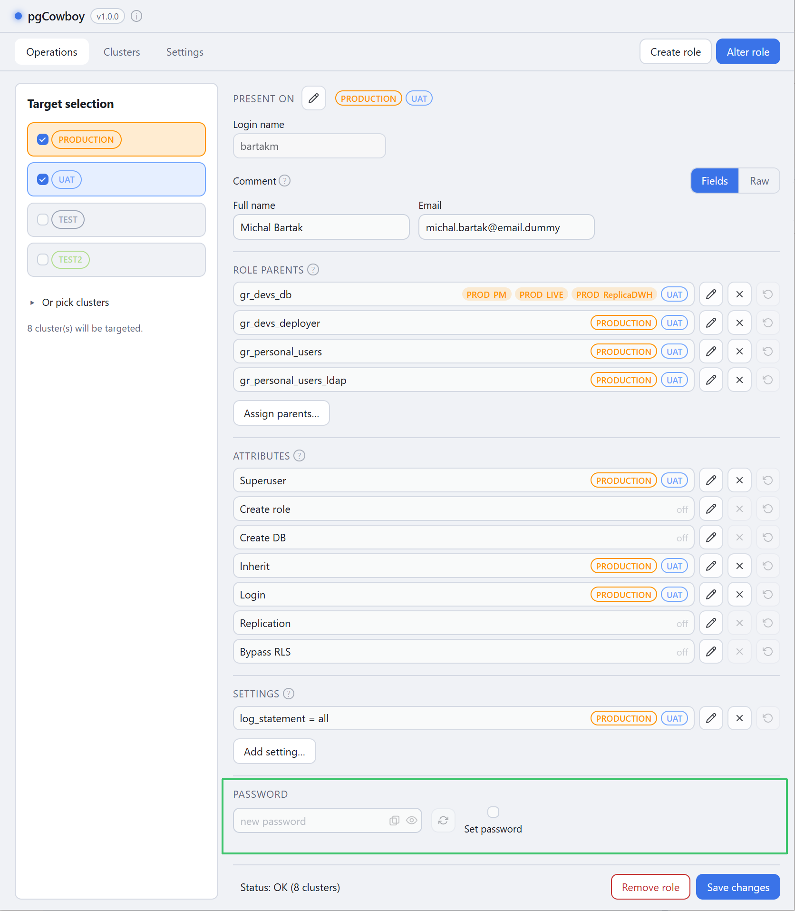
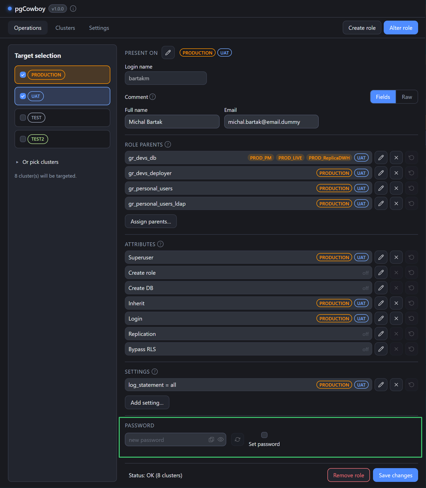

The password row sits with the rest of the form and is off until you ask for it.

<figure class="shot">

<figcaption>Password row — Set password checkbox, masked field with Copy and reveal, Generate button</figcaption>
</figure>

## Set password

Nothing happens to the password unless **Set password** is ticked. Until then the field, **Generate**, **Copy** and the reveal eye are all disabled.

| Control | Effect |
|---------|--------|
| **Set password** | Arms the row. Only then is a password sent. |
| Field | Masked. Type your own, or use Generate. |
| <svg class="doc-ic" viewBox="0 0 24 24" fill="none" stroke="currentColor" stroke-width="1.8" stroke-linecap="round" stroke-linejoin="round" aria-hidden="true"><path d="M1.5 12S5 5 12 5s10.5 7 10.5 7-3.5 7-10.5 7S1.5 12 1.5 12Z"/><circle cx="12" cy="12" r="3.2"/></svg> **Reveal** | Shows the value while you check it. |
| <svg class="doc-ic" viewBox="0 0 16 16" fill="none" stroke="currentColor" stroke-width="1.5" stroke-linecap="round" stroke-linejoin="round" aria-hidden="true"><rect x="5" y="1" width="10" height="11" rx="2"/><rect x="1" y="4" width="10" height="11" rx="2"/></svg> **Copy** | Copies the value even while masked, so you can paste it into a ticket or vault. |
| <svg class="doc-ic" viewBox="0 0 24 24" fill="none" stroke="currentColor" stroke-width="2" stroke-linecap="round" stroke-linejoin="round" aria-hidden="true"><polyline points="23 4 23 10 17 10"/><polyline points="1 20 1 14 7 14"/><path d="M3.51 9a9 9 0 0 1 14.85-3.36L23 10M1 14l4.64 4.36A9 9 0 0 0 20.49 15"/></svg> **Generate** | Fills the field with a fresh random password. |

## Generate

**Generate** builds a password from your [password generator settings](/pgcowboy/configuration/password-generator/) — length, character classes, and whether look-alike characters are excluded — using the platform's cryptographic random source. Press it again for a different one.

:::caution
Copy the password before you save. The app never displays it again.
:::

## Where it applies

On **Save changes** the password is set on **every cluster in [scope](/pgcowboy/usage/) where the role exists**, as part of that cluster's transaction. It runs through the `change_password` [call template](/pgcowboy/configuration/call-templates/), which is `ALTER ROLE … PASSWORD …` by default.

:::tip
Passwords are not stored in the app's configuration, and they are not shown in the [command log](/pgcowboy/usage/command-log/).
:::
