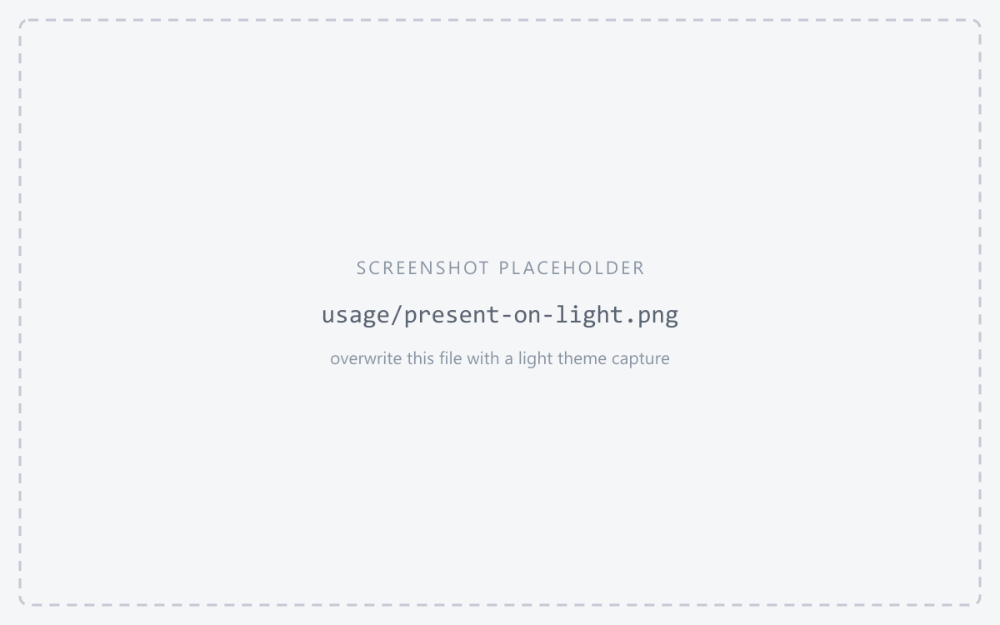
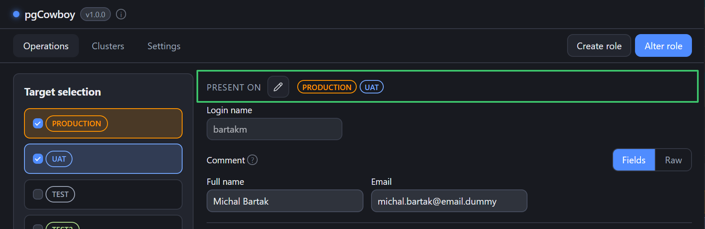
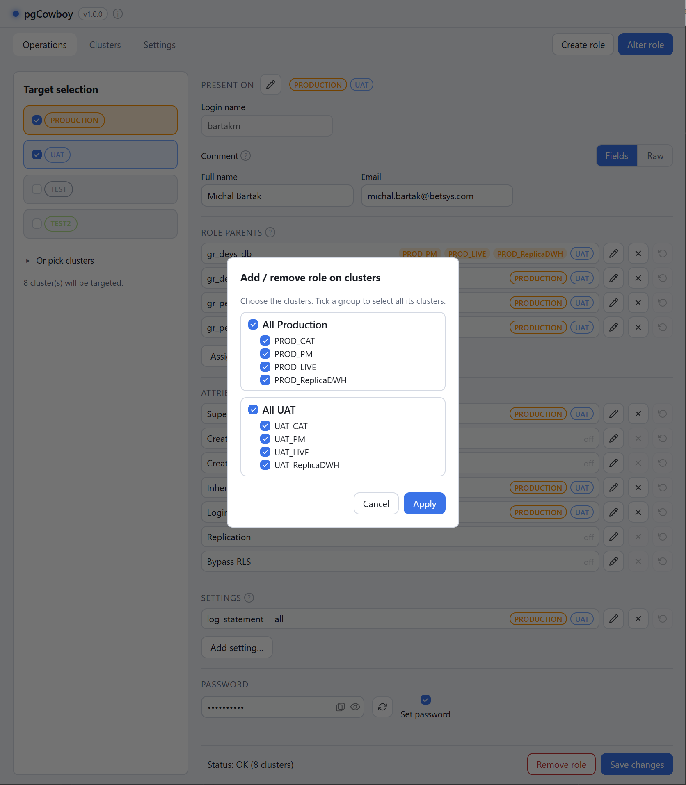
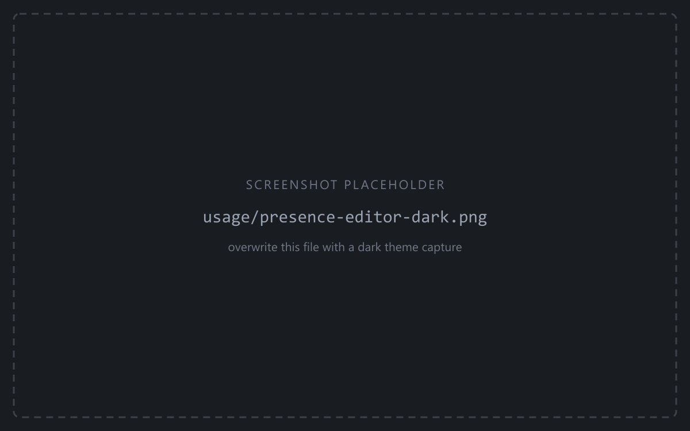
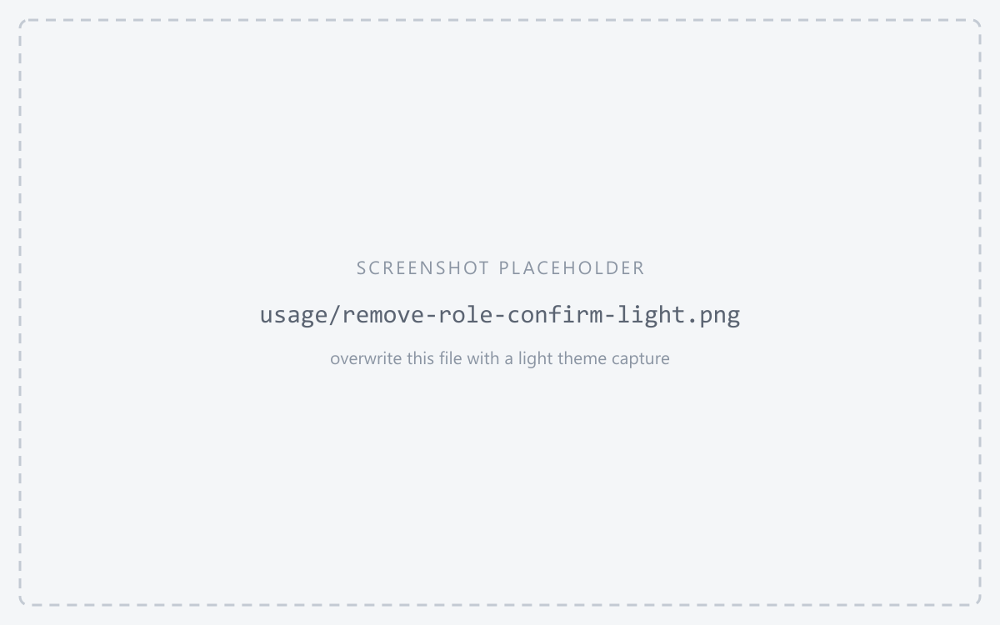
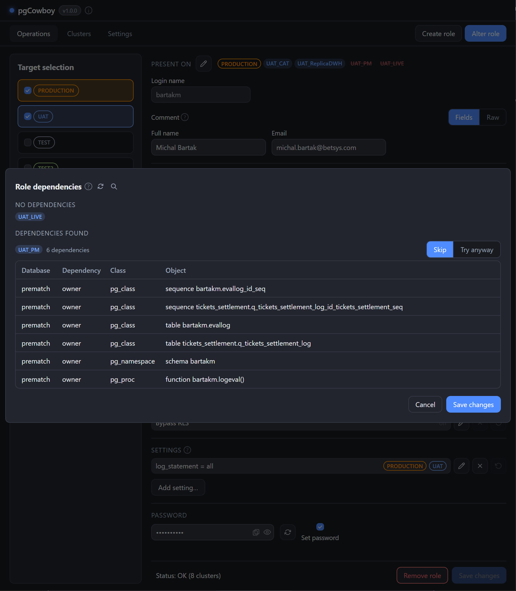

The **Present on** block, just above the login name, shows which clusters the role exists on, using the shared [scope labels](/pgcowboy/usage/#scope-labels).

<figure class="shot">

<figcaption>Present on section</figcaption>
</figure>

## Editing presence

The <svg class="doc-ic" width="1.05em" height="1.05em" viewBox="0 0 24 24" fill="none" stroke="currentColor" stroke-width="2" stroke-linecap="round" stroke-linejoin="round" aria-hidden="true"><path d="M21.174 6.812a1 1 0 0 0-3.986-3.987L3.842 16.174a2 2 0 0 0-.5.83l-1.321 4.352a.5.5 0 0 0 .623.622l4.353-1.32a2 2 0 0 0 .83-.497z"/><path d="m15 5 4 4"/></svg> **edit** button opens a picker listing the role's [scope](/pgcowboy/usage/) — the clusters that Target selection resolved to when you searched. Tick to create the role on added cluster or untick to drop role from removed cluster.

<figure class="shot">

<figcaption>Presence picker</figcaption>
</figure>

**Dropping** a cluster records a `DROP ROLE` for that cluster alone, pre-flighted by the [dependency check](#dependency-check-before-a-drop) when you Save.

**Adding** a cluster brings the whole form to bear on it: role parents, attributes, settings and the comment all target it too. A `CREATE ROLE` is prepended to that cluster's transaction on Save. Whether creation is staged automatically is a [general setting](/pgcowboy/configuration/general/).

:::tip
The picker only offers clusters that are in the role's scope. To bring in another one, change the selected targets.
:::

:::caution
The role added by extending the presence, will receive no password unless the password change is requested too
:::

## Remove role

The red **Remove role** button drops the role from **every cluster in scope where it exists**. It always performs[dependency check](#dependency-check-before-a-drop) described below and requests for additional confirmation for groups flagged *require confirmation*.

## Dependency check before a drop

Before a `DROP ROLE` goes out — whether from **Remove role** or from a cluster you dropped in the presence picker, the app reads the objects that depend on the role on every targeted cluster and shows them per cluster.

<figure class="shot">

<figcaption>Dependency check</figcaption>
</figure>

Clusters are grouped into three sections, in this order — and inside each by group, then alias:

1. **No dependencies** — just the list of clusters. They are dropped without further asking.
1. **Could not be checked** — the cluster and error reason).
1. **Dependencies found** — per cluster, the objects that depend on the role.

Everything in the last two sections defaults to **Skip** and is left out of the run entirely. Switch a cluster to **Try anyway** to attempt the drop regardless: the outcome is shows in the [command log](/pgcowboy/usage/command-log/) like in any other run.

:::tip
If you clear the dependencies elsewhere while the popup is open, the **reload** button next to the title re-runs the check on the same clusters without closing the dialog. Any *Try anyway* you already picked is kept where it still applies.
:::

The query sent to each cluster uses configurable `Role dependencies` [template](/pgcowboy/configuration/call-templates/). It can be looked with use of the small magnifier next to the popup's title.

:::caution
The default query reads `pg_shdepend`, which covers the objects of the database the app connects to plus cluster-wide ones. Dependencies with another database on the same cluster are listed but not named.
:::
