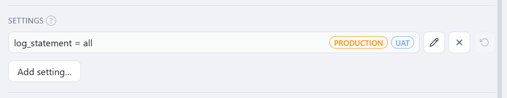
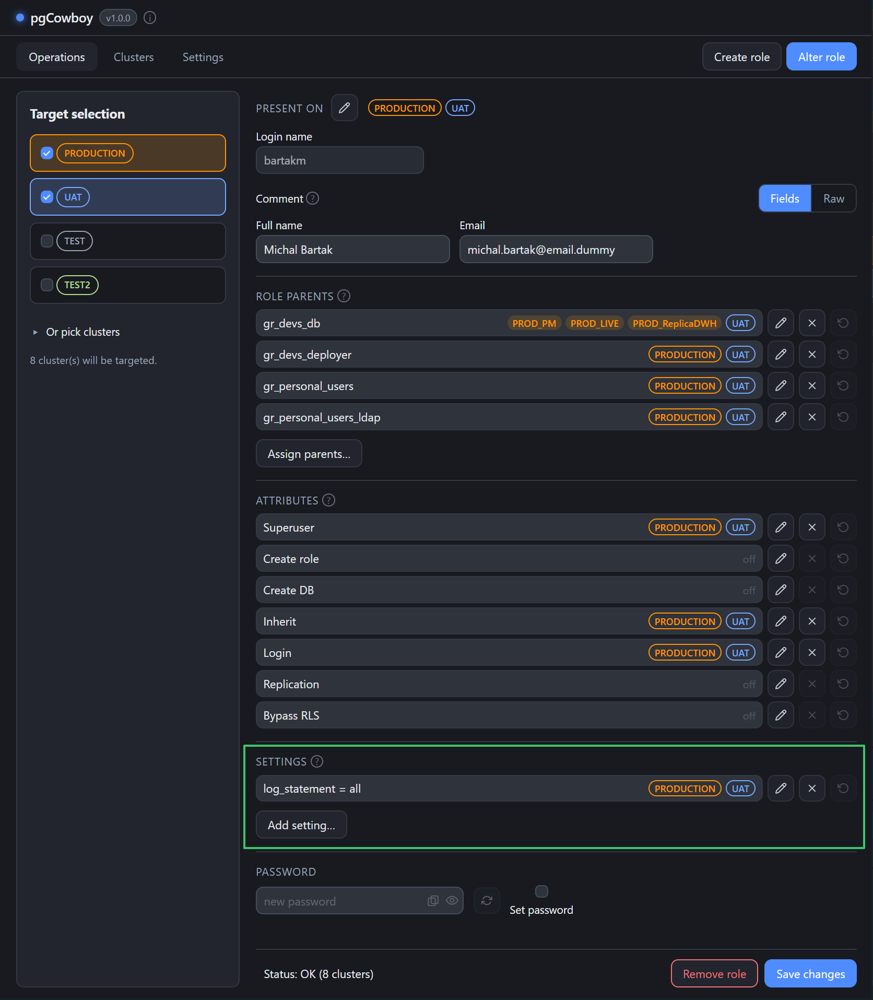
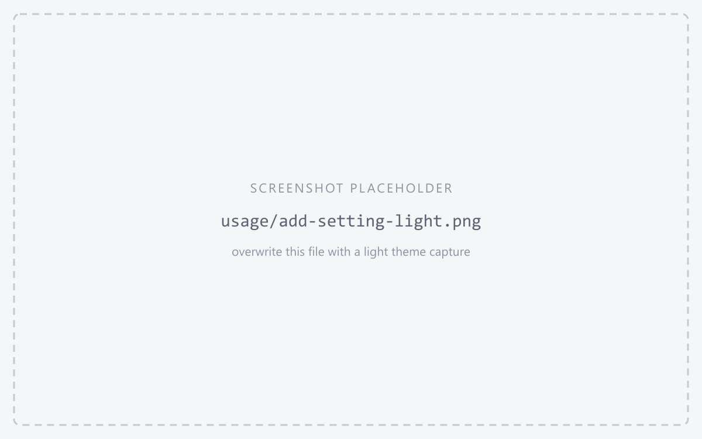
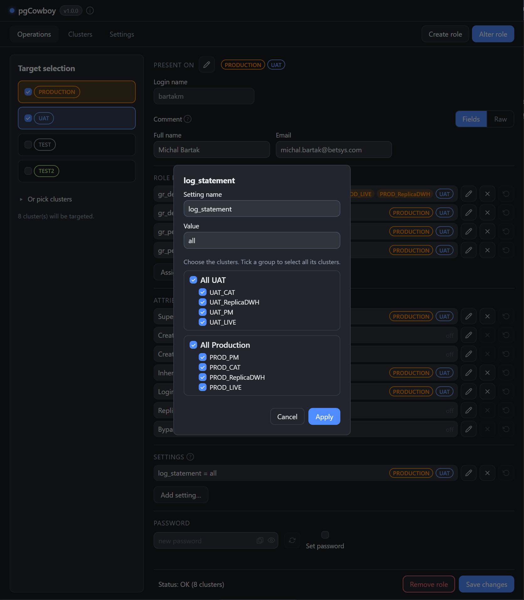

**Settings** are role-level configuration parameters (`GUC`s) — `statement_timeout`, `log_statement`, `search_path`, and so on. They are read from the clusters and use the editor similar to [role parents](/pgcowboy/usage/parent-roles/).

<figure class="shot">

<figcaption>Role settings section</figcaption>
</figure>

## Name and value

A setting can hold a different value on different clusters, so rows are keyed by `name=value`. The same parameter with two values shows as two rows, each with its own scope.

| Button | Effect |
|--------|--------|
| <svg class="doc-ic" width="1.05em" height="1.05em" viewBox="0 0 24 24" fill="none" stroke="currentColor" stroke-width="2" stroke-linecap="round" stroke-linejoin="round" aria-hidden="true"><path d="M21.174 6.812a1 1 0 0 0-3.986-3.987L3.842 16.174a2 2 0 0 0-.5.83l-1.321 4.352a.5.5 0 0 0 .623.622l4.353-1.32a2 2 0 0 0 .83-.497z"/><path d="m15 5 4 4"/></svg> **Edit** | Sets that name/value where you tick, clears it where you untick. |
| <svg class="doc-ic" width="1.05em" height="1.05em" viewBox="0 0 24 24" fill="none" stroke="currentColor" stroke-width="2" stroke-linecap="round" stroke-linejoin="round" aria-hidden="true"><line x1="18" y1="6" x2="6" y2="18"/><line x1="6" y1="6" x2="18" y2="18"/></svg> **Remove** | Resets the parameter on every cluster in scope. |
| <svg class="doc-ic" width="1.05em" height="1.05em" viewBox="0 0 24 24" fill="none" stroke="currentColor" stroke-width="2" stroke-linecap="round" stroke-linejoin="round" aria-hidden="true"><polyline points="1 4 1 10 7 10"/><path d="M3.51 15a9 9 0 1 0 2.13-9.36L1 10"/></svg> **Discard** | Discards pending changes on that row. |

## Adding a setting

**Add setting…** takes a parameter **name** and a **value**, plus the clusters to apply them to. When creating a new role, the popup opens with all clusters selected.

<figure class="shot">

<figcaption>Add/alter role setting dialog</figcaption>
</figure>

On save all perfoemed changes translates into `Set config` and `Reset config` operations.
(`ALTER ROLE … SET name = value` / `ALTER ROLE … RESET name` by default).
